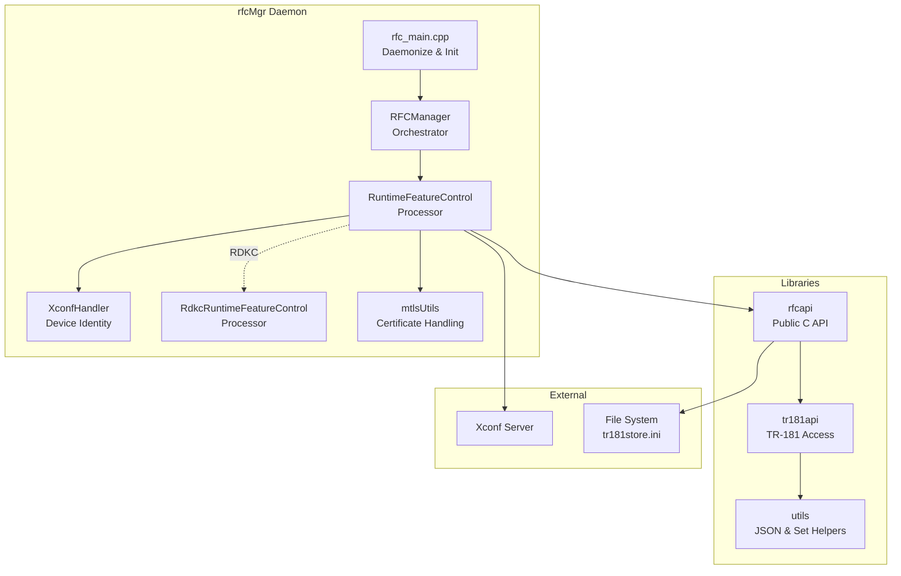

# RFC — Remote Feature Control

[](#building)
[](LICENSE)
[](#platform-support)

> C++ daemon and API library for fetching, applying, and managing Remote Feature Control (RFC) settings from an Xconf configuration server across RDK device platforms.

---

## Table of Contents

- [Overview](#overview)
- [Platform Support](#platform-support)
- [Repository Structure](#repository-structure)
- [Architecture Overview](#architecture-overview)
- [Building](#building)
- [Configuration](#configuration)
- [Usage](#usage)
- [Testing](#testing)
- [Documentation](#documentation)
- [Contributing](#contributing)
- [License](#license)

---

## Overview

The RFC (Remote Feature Control) module enables dynamic configuration of RDK device features at runtime by fetching policy updates from an XConf server and applying them as TR181 data-model parameters. It ships as a daemon (`rfcMgr`) plus two reusable libraries (`librfcapi`, `libtr181api`) consumed by other RDK components.

Licensed under the Apache License 2.0. Copyright 2016–2024 RDK Management.

**rfcMgr** is a C++ daemon that replaces the legacy shell-based `RFCbase.sh` for Remote Feature Control. It:

1. **Detects** when the device is online
2. **Collects** device identity (MAC, firmware, model, partner ID, account ID)
3. **Queries** the Xconf server for feature-control configuration
4. **Applies** RFC parameters to the local device
5. **Evaluates** whether a reboot is needed for `effectiveImmediate` features
6. **Schedules** periodic re-checks via cron

The **rfcapi** library provides a public C API (`getRFCParameter`, `setRFCParameter`, `isRFCEnabled`) for other RDK components to read/write RFC parameters.

---

## Platform Support

| Platform | Define Flag | Description |
|----------|-------------|-------------|
| **STB** | *(default)* | Set-Top Box — uses hostif/WDMP APIs, TR-181 data model |
| **RDKB** | `-DRDKB_SUPPORT` | RDK Broadband — uses rbus for TR-181 access |
| **RDKC** | `-DRDKC` | RDK Camera (XHC1/XCAM2) — flat-file parameter storage, mfrApi for device identity |

All platform-specific code is behind `#ifdef` guards, ensuring a single codebase builds cleanly for all targets.

---

## Quick Start

```bash
# Build (inside the native-platform container)
autoreconf -i
./configure --prefix=/usr --enable-rfctool=yes --enable-tr181set=yes
make && make install

# Run unit tests
sh run_ut.sh

# Run L2 functional tests
sh run_l2.sh
sh run_l2_reboot_trigger.sh
```

---

## Repository Structure

```
rfc-fork/
├── rfcMgr/                        # RFC Manager daemon (core component)
│   ├── rfc_main.cpp               # Entry point — daemonize, init directories
│   ├── rfc_manager.h/cpp          # Lifecycle orchestrator
│   ├── xconf_handler.h/cpp        # Base device-identity collector
│   ├── rfc_xconf_handler.h/cpp    # Core RFC state machine & Xconf logic
│   ├── rdkc_rfc_xconf_handler.h/cpp  # RDKC camera-specific overrides
│   ├── mtlsUtils.h/cpp            # mTLS certificate handling
│   ├── rfc_common.h/cpp           # Shared utilities
│   ├── rfc_mgr_iarm.h             # IARM bus integration
│   ├── rfc_mgr_json.h             # JSON field constants
│   ├── rfc_mgr_key.h              # Configuration key constants
│   └── gtest/                     # Unit & L2 integration tests
│       └── mocks/                 # Test doubles
├── rfcapi/                        # Public RFC parameter API library
│   ├── rfcapi.h                   # C API header
│   └── rfcapi.cpp                 # Implementation
├── tr181api/                      # TR-181 data model API
│   ├── tr181api.h
│   └── tr181api.cpp
├── utils/                         # Utility libraries
│   ├── jsonhandler.h/cpp          # JSON parsing helpers
│   ├── trsetutils.h/cpp           # TR-181 set utilities
│   └── tr181utils.cpp             # TR-181 access utilities
├── test/                          # Functional test suite
│   └── functional-tests/
├── documentation/                 # Architecture & design docs
│   ├── architecture.md            # Component architecture & class diagrams
│   ├── sequence-diagrams.md       # End-to-end sequence flows
│   └── data-processing-flow.md    # Data processing & parameter flow
├── .github/                       # CI/CD workflows
│   ├── workflows/
│   └── CODEOWNERS
├── configure.ac                   # Autotools build configuration
├── Makefile.am                    # Top-level Automake
├── rfc.properties                 # Runtime configuration
├── getRFC.sh                      # Legacy shell wrapper
├── isFeatureEnabled.sh            # Feature check script
├── CHANGELOG.md                   # Release history
├── CONTRIBUTING.md                # Contribution guidelines
├── LICENSE / COPYING / NOTICE     # Legal
└── run_ut.sh / run_l2.sh         # Test runners
```

---

## Architecture Overview



**Class Hierarchy:**

```
XconfHandler (device identity collection)
  └── RuntimeFeatureControlProcessor (Xconf query, parse, apply)
        └── RdkcRuntimeFeatureControlProcessor (camera-specific overrides)
```

For detailed architecture diagrams, see [documentation/architecture.md](documentation/architecture.md).

---

## Building

### Prerequisites

- GNU Autotools (`autoconf`, `automake`, `libtool`)
- C++11 compiler
- `libcurl`, `libcjson`
- Platform-specific: `librbus` (RDKB), `libhostif` (STB), `libmfrapi` (RDKC)

### Build Commands

```bash
# Generate build system
autoreconf -i

# Configure for target platform
./configure                          # STB (default)
./configure --enable-rdkc            # RDK Camera
./configure --enable-rdkb            # RDK Broadband

# Build
make

# Install
make install    # Installs /usr/bin/rfcMgr and librfcapi

# Unit tests
./configure --enable-gtestapp
make check
```

### Build Flags

| Option | Description |
|--------|-------------|
| `--enable-rdkc` | Enable RDKC camera platform support |
| `--enable-rdkb` | Enable RDKB broadband platform support |
| `--enable-gtestapp` | Enable Google Test unit tests |
| `--enable-rdkcertselector` | Use `librdkcertselector` for mTLS |
| `--enable-mountutils` | Use `librdkconfig` for configuration |
| `--enable-rfctool=yes` | Build `librfcapi` (default: yes) |
| `--enable-tr181set=yes` | Build `libtr181api` |
| `--enable-rdkcertselector=yes` | Enable `librdkcertselector` for dynamic mTLS cert selection |
| `--enable-iarmbus=yes` | Enable IARM bus integration |

---

## Configuration

### rfc.properties

Runtime configuration is read from `rfc.properties`:

| Property | Description |
|----------|-------------|
| `RFC_CONFIG_SERVER_URL` | Primary Xconf server endpoint |
| `RFC_CONFIG_SERVER_URL_EU` | EU region Xconf server endpoint |
| `RFC_RAM_PATH` | Temporary storage path (`/tmp/RFC`) |
| `TR181_STORE_FILENAME` | Persistent parameter storage file |
| `RFC_POSTPROCESS` | Post-processing script path |
| `RFC_SERVICE_LOCK` | Lock file to prevent concurrent runs |

---

## Platform Notes

### RDK-V (Video — default)
- TR181 store at `/opt/secure/RFC/`
- Debug ini override at `/opt/debug.ini`
- IARM bus integration via `USE_IARMBUS`
- Maintenance manager events (`EN_MAINTENANCE_MANAGER`)

### RDK-B (Broadband — `--enable-rdkb`)
- Debug ini at `/nvram/debug.ini`
- Log file at `/rdklogs/logs/dcmrfc.log.0`
- rbus integration in addition to IARM
- `waitForRfcCompletion()` synchronization at startup

### RDK-C (Camera — `--enable-rdkc`)
- Simplified `getRFCParameter` without WDMP/tr69hostif
- File-based lookup only

---

## Key Files and Paths

| Path | Purpose |
|------|---------|
| `/opt/secure/RFC/tr181store.ini` | Persisted TR181 parameter values from XConf |
| `/opt/secure/RFC/rfcVariable.ini` | Legacy RFC variable store |
| `/opt/secure/RFC/bootstrap.ini` | Bootstrap XConf URL and OsClass |
| `/opt/secure/RFC/tr181localstore.ini` | Local (non-XConf) TR181 parameter store |
| `/opt/secure/RFC/.version` | Last processed firmware version |
| `/opt/rfc.properties` | Runtime RFC server URL override |
| `/etc/rfc.properties` | Default RFC server properties |
| `/tmp/.rfcServiceLock` | PID lock file (prevents multiple instances) |
| `/tmp/.rfcSyncDone` | Signals RFC sync completion |
| `/etc/rfcdefaults/` | Component default INI files |
| `/tmp/rfcdefaults.ini` | Merged defaults file (generated at runtime) |

---

### RDKC Device Files

| File | Purpose |
|------|---------|
| `/opt/usr_config/partnerid.txt` | Syndication partner ID |
| `/opt/usr_config/service_number.txt` | Account ID |
| `/opt/usr_config/accounthash.txt` | MD5 account hash |
| `/opt/secure/RFC/tr181store.ini` | Persisted RFC parameters |
| `/tmp/RFC/.hashValue` | Configuration hash (RAM) |
| `/tmp/RFC/.timeValue` | Last update timestamp (RAM) |

---

## Usage

```bash
# Run the RFC manager daemon
/usr/bin/rfcMgr

# Check if a feature is enabled
./isFeatureEnabled.sh <feature_name>

# Query RFC settings (legacy shell)
./getRFC.sh
```

### rfcapi Library

```c
#include "rfcapi.h"

// Read a parameter
RFC_ParamData_t param;
int ret = getRFCParameter("module", "Device.X_RDK.Feature.Enable", &param);
if (ret == 0) {
    printf("Value: %s, Type: %d\n", param.value, param.type);
}

// Check feature status
if (isRFCEnabled("AccountInfo")) {
    // Feature is active
}
```
| `librfcapi` | `rfcapi/rfcapi.cpp` | Public C API for RFC parameter get/set used by all RDK components |
| `libtr181api` | `tr181api/tr181api.cpp` | Higher-level TR181 API with typed parameters, local store, and defaults |
| `jsonhandler` | `utils/jsonhandler.cpp` | Parses XConf JSON response payloads |
| `tr181utils` | `utils/tr181utils.cpp` | TR181 store manipulation utilities |

---

## Error Codes

| Code | Value | Meaning |
|------|-------|---------|
| `SUCCESS` | 0 | Operation succeeded |
| `FAILURE` | -1 | Operation failed |
| `NO_RFC_UPDATE_REQUIRED` | 1 | Settings unchanged; no write needed |
| `WRITE_RFC_SUCCESS` | 1 | TR181 write succeeded |
| `WRITE_RFC_FAILURE` | -1 | TR181 write failed |
| `READ_RFC_SUCCESS` | 1 | TR181 read succeeded |
| `READ_RFC_FAILURE` | -1 | TR181 read failed |

---

## Testing

```bash
# Unit tests (L1)
./run_ut.sh

# L2 integration tests
./run_l2.sh

# L2 reboot trigger tests
./run_l2_reboot_trigger.sh
```

Test coverage is tracked via GitHub Actions workflows:
- `L1-Test.yaml` — Unit test execution
- `L2-tests.yml` — Integration test execution
- `code-coverage.yml` — Coverage reporting

# Individual binaries
./rfcMgr/gtest/rfcMgr_gtest      # RFCManager / XConf handler tests
./rfcMgr/gtest/rfcapi_gtest      # RFC API get/set tests
./rfcMgr/gtest/tr181api_gtest    # TR181 API tests
./rfcMgr/gtest/utils_gtest       # JSON handler / TR181 utils tests

---

## Documentation

| Document | Description |
|----------|-------------|
| [Architecture](documentation/architecture.md) | Component architecture, class hierarchy, build system |
| [Sequence Diagrams](documentation/sequence-diagrams.md) | End-to-end execution flows with Mermaid diagrams |
| [Data Processing Flow](documentation/data-processing-flow.md) | Parameter lifecycle, storage strategies, data transformations |
| [Changelog](CHANGELOG.md) | Release history and version changes |
| [Contributing](CONTRIBUTING.md) | How to contribute to this project |

---

## Contributing

Please read [CONTRIBUTING.md](CONTRIBUTING.md) for details on the contribution process, coding standards, and how to submit pull requests.

Before RDK accepts your code, you must sign the [RDK Contributor License Agreement (CLA)](https://wiki.rdkcentral.com/display/DOC/Contributor+License+Agreement).

---

## License

This project is licensed under the Apache License, Version 2.0 — see the [LICENSE](LICENSE) file for details.

```
Copyright 2018-2026 RDK Management

Licensed under the Apache License, Version 2.0
```
---

## See Also

- [rfcapi API Reference](rfcapi/docs/README.md)
- [tr181api API Reference](tr181api/docs/README.md)
- [Build System Instructions](.github/instructions/build-system.instructions.md)
- [C Embedded Standards](.github/instructions/c-embedded.instructions.md)
- [L2 Test Runner Agent](.github/agents/l2-test-runner.agent.md)
