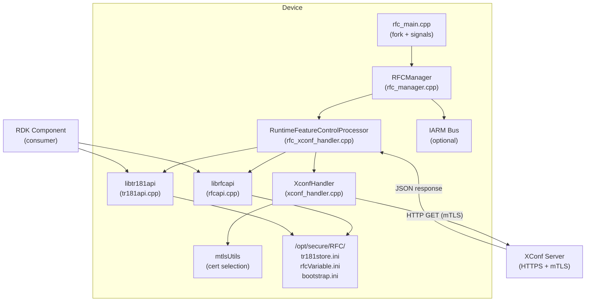
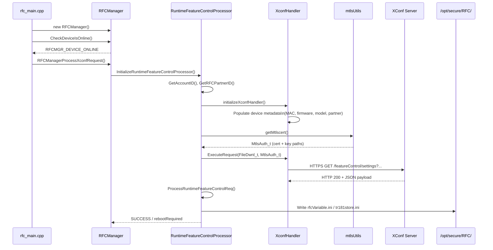
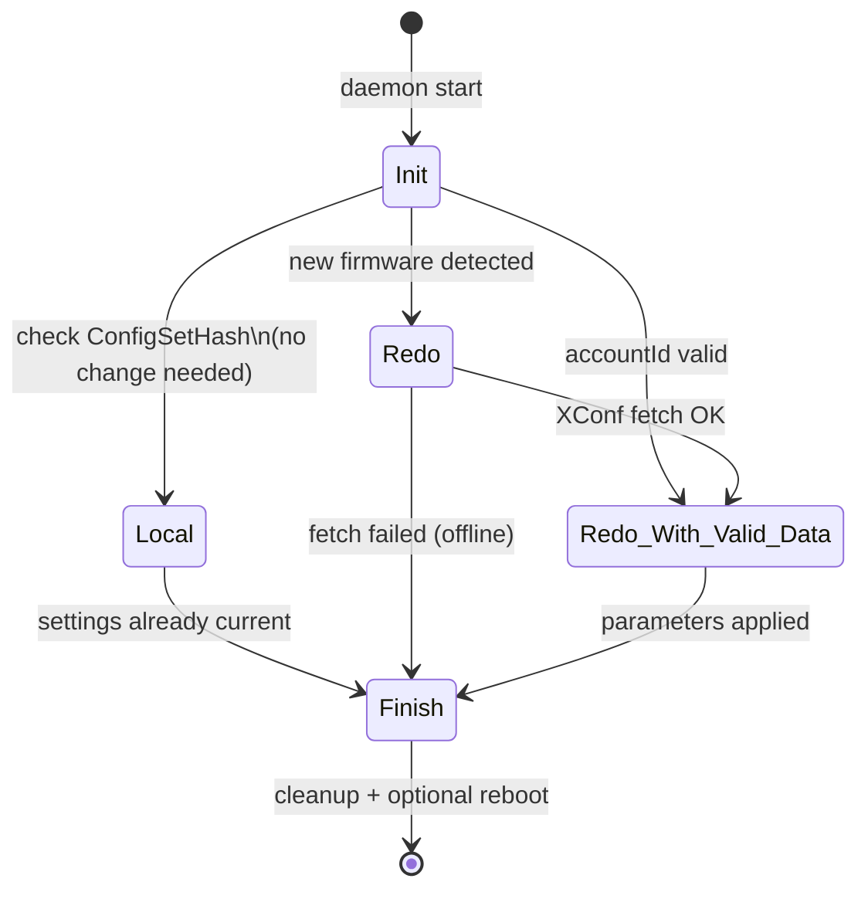

# RFC — Remote Feature Control Module

## Overview

The RFC (Remote Feature Control) module enables dynamic configuration of RDK device features at runtime by fetching policy updates from an XConf server and applying them as TR181 data-model parameters. It ships as a daemon (`rfcMgr`) plus two reusable libraries (`librfcapi`, `libtr181api`) consumed by other RDK components.

Licensed under the Apache License 2.0. Copyright 2016–2024 RDK Management.

---

## Quick Start

```bash
# Build (inside the native-platform container)
autoreconf -i
./configure --prefix=/usr --enable-rfctool=yes --enable-tr181set=yes
make && make install

# Run unit tests
sh run_ut.sh

# Run L2 functional tests
sh run_l2.sh
sh run_l2_reboot_trigger.sh
```

---

## Repository Structure

```
rfc/
├── configure.ac              # Autoconf build configuration
├── Makefile.am               # Top-level automake
├── rfc.properties            # Default RFC server properties
├── rfcMgr/                   # RFC manager daemon
│   ├── rfc_main.cpp          # Entry point, fork, signal handling
│   ├── rfc_manager.cpp/.h    # RFCManager class — orchestrates fetch/apply
│   ├── rfc_common.cpp/.h     # Shared utilities, macros, error codes
│   ├── rfc_xconf_handler.cpp/.h   # RuntimeFeatureControlProcessor
│   ├── xconf_handler.cpp/.h       # XconfHandler — HTTP device metadata
│   ├── mtlsUtils.cpp/.h           # mTLS certificate selection
│   ├── rfc_mgr_key.h              # TR181 key string constants
│   ├── rfc_mgr_json.h             # JSON payload processing
│   ├── rfc_mgr_iarm.h             # IARM bus definitions
│   └── gtest/                     # Unit tests + mocks
├── rfcapi/                   # Public RFC get/set API library
│   ├── rfcapi.cpp/.h         # getRFCParameter / setRFCParameter
│   └── docs/                 # rfcapi documentation
├── tr181api/                 # TR181 parameter store API library
│   ├── tr181api.cpp/.h       # getParam / setParam / clearParam
│   └── docs/                 # tr181api documentation
├── utils/                    # Shared JSON and TR181 utilities
│   ├── jsonhandler.cpp/.h
│   ├── tr181utils.cpp
│   └── trsetutils.cpp/.h
└── test/                     # L2 functional tests
    └── functional-tests/
```

---

## System Architecture



---

## Key Workflows

### RFC Fetch and Apply Workflow



### RFC State Machine



---

## Component Descriptions

| Component | Location | Role |
|-----------|----------|------|
| `rfc_main.cpp` | `rfcMgr/` | Entry point — forks daemon, manages PID lock, handles SIGTERM |
| `RFCManager` | `rfcMgr/rfc_manager.cpp` | Orchestrates online-check, IARM init, XConf request cycle |
| `RuntimeFeatureControlProcessor` | `rfcMgr/rfc_xconf_handler.cpp` | Extends XconfHandler; owns RFC state machine and parameter apply |
| `XconfHandler` | `rfcMgr/xconf_handler.cpp` | Populates device metadata; executes HTTPS request via libcurl |
| `mtlsUtils` | `rfcMgr/mtlsUtils.cpp` | Selects dynamic or static mTLS certificate; optionally uses librdkcertselector |
| `librfcapi` | `rfcapi/rfcapi.cpp` | Public C API for RFC parameter get/set used by all RDK components |
| `libtr181api` | `tr181api/tr181api.cpp` | Higher-level TR181 API with typed parameters, local store, and defaults |
| `jsonhandler` | `utils/jsonhandler.cpp` | Parses XConf JSON response payloads |
| `tr181utils` | `utils/tr181utils.cpp` | TR181 store manipulation utilities |

---

## Build Options

| `configure` flag | Effect |
|-----------------|--------|
| `--enable-rfctool=yes` | Build `librfcapi` (default: yes) |
| `--enable-tr181set=yes` | Build `libtr181api` |
| `--enable-gtestapp=yes` | Build gtest binaries in `rfcMgr/gtest/` |
| `--enable-rdkcertselector=yes` | Enable `librdkcertselector` for dynamic mTLS cert selection |
| `--enable-mountutils=yes` | Enable `librdkconfig` for config mount utilities |
| `--enable-rdkb=yes` | Enable RDK-B (broadband) platform adaptations |
| `--enable-rdkc=yes` | Enable RDK-C (camera) platform adaptations |
| `--enable-iarmbus=yes` | Enable IARM bus integration |

---

## Platform Notes

### RDK-V (Video — default)
- TR181 store at `/opt/secure/RFC/`
- Debug ini override at `/opt/debug.ini`
- IARM bus integration via `USE_IARMBUS`
- Maintenance manager events (`EN_MAINTENANCE_MANAGER`)

### RDK-B (Broadband — `--enable-rdkb`)
- Debug ini at `/nvram/debug.ini`
- Log file at `/rdklogs/logs/dcmrfc.log.0`
- rbus integration in addition to IARM
- `waitForRfcCompletion()` synchronization at startup

### RDK-C (Camera — `--enable-rdkc`)
- Simplified `getRFCParameter` without WDMP/tr69hostif
- File-based lookup only

---

## Key Files and Paths

| Path | Purpose |
|------|---------|
| `/opt/secure/RFC/tr181store.ini` | Persisted TR181 parameter values from XConf |
| `/opt/secure/RFC/rfcVariable.ini` | Legacy RFC variable store |
| `/opt/secure/RFC/bootstrap.ini` | Bootstrap XConf URL and OsClass |
| `/opt/secure/RFC/tr181localstore.ini` | Local (non-XConf) TR181 parameter store |
| `/opt/secure/RFC/.version` | Last processed firmware version |
| `/opt/rfc.properties` | Runtime RFC server URL override |
| `/etc/rfc.properties` | Default RFC server properties |
| `/tmp/.rfcServiceLock` | PID lock file (prevents multiple instances) |
| `/tmp/.rfcSyncDone` | Signals RFC sync completion |
| `/etc/rfcdefaults/` | Component default INI files |
| `/tmp/rfcdefaults.ini` | Merged defaults file (generated at runtime) |

---

## Error Codes

| Code | Value | Meaning |
|------|-------|---------|
| `SUCCESS` | 0 | Operation succeeded |
| `FAILURE` | -1 | Operation failed |
| `NO_RFC_UPDATE_REQUIRED` | 1 | Settings unchanged; no write needed |
| `WRITE_RFC_SUCCESS` | 1 | TR181 write succeeded |
| `WRITE_RFC_FAILURE` | -1 | TR181 write failed |
| `READ_RFC_SUCCESS` | 1 | TR181 read succeeded |
| `READ_RFC_FAILURE` | -1 | TR181 read failed |

---

## Testing

### Unit Tests (`rfcMgr/gtest/`)

```bash
# Build and run all unit tests
sh run_ut.sh

# Individual binaries
./rfcMgr/gtest/rfcMgr_gtest      # RFCManager / XConf handler tests
./rfcMgr/gtest/rfcapi_gtest      # RFC API get/set tests
./rfcMgr/gtest/tr181api_gtest    # TR181 API tests
./rfcMgr/gtest/utils_gtest       # JSON handler / TR181 utils tests
```

### L2 Functional Tests (`test/functional-tests/`)

```bash
sh run_l2.sh                  # Main L2 test suite (XConf, TR181, feature flags)
sh run_l2_reboot_trigger.sh   # Reboot trigger / unknown-accountId flow
```

Results land in `/tmp/rfc_test_report/` as JSON files.

---

## See Also

- [rfcapi API Reference](rfcapi/docs/README.md)
- [tr181api API Reference](tr181api/docs/README.md)
- [Build System Instructions](.github/instructions/build-system.instructions.md)
- [C Embedded Standards](.github/instructions/c-embedded.instructions.md)
- [L2 Test Runner Agent](.github/agents/l2-test-runner.agent.md)
