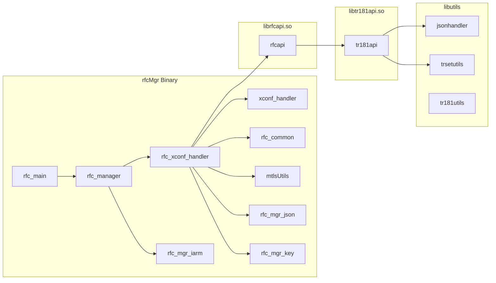
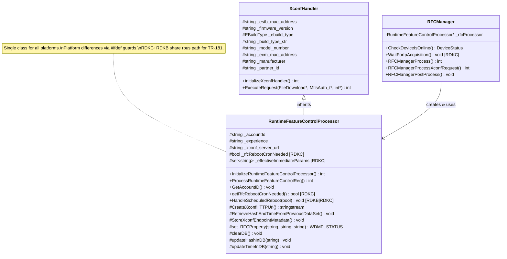
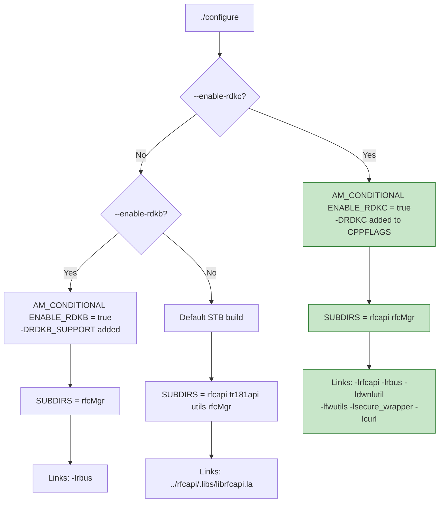

# Architecture

> Component architecture, class hierarchy, and build system design for the RFC (Remote Feature Control) daemon.

---

## Table of Contents

- [1. High-Level Architecture](#1-high-level-architecture)
- [2. Component Diagram](#2-component-diagram)
- [3. Class Hierarchy](#3-class-hierarchy)
- [4. Build System Architecture](#4-build-system-architecture)
- [5. Platform Abstraction Strategy](#5-platform-abstraction-strategy)
- [6. File Responsibilities](#6-file-responsibilities)
- [7. Dependency Graph](#7-dependency-graph)
- [8. External Integrations](#8-external-integrations)

---

## 1. High-Level Architecture

The `rfcMgr` daemon is a multi-platform C++ application that replaces the legacy `RFCbase.sh` shell script. It uses a polymorphic class hierarchy with `#ifdef` conditional compilation to support STB, RDKB, and RDKC platforms from a single codebase.

```mermaid
graph TD
    subgraph "Entry & Lifecycle"
        A["rfc_main.cpp<br/>fork() &#8226; signal handlers &#8226; directory setup"]
    end

    subgraph "Orchestration"
        B["RFCManager<br/>Device online check &#8226; processor lifecycle<br/>post-processing &#8226; cron scheduling"]
    end

    subgraph "RFC Processing Engine"
        C["XconfHandler<br/>Device identity collection<br/>MAC &#8226; FW &#8226; model &#8226; partner ID"]
        D["RuntimeFeatureControlProcessor<br/>Xconf query &#8226; JSON parse &#8226; param apply<br/>hash/time management &#8226; reboot eval<br/>#ifdef RDKC: provisioning check &#8226; effectiveImmediate"]
    end

    subgraph "Security & Platform Utilities"
        F["mtlsUtils<br/>Dynamic XPKI &#8226; Static XPKI &#8226; cert selector<br/>getEstbMacAddress &#8226; getPartnerIdFromFile<br/>getAccountHashFromFile &#8226; isDeviceProvisioned"]
    end

    subgraph "Public API"
        G["rfcapi (librfcapi)<br/>getRFCParameter() &#8226; setRFCParameter()<br/>isRFCEnabled()"]
    end

    subgraph "Data Model Layer"
        H["tr181api / utils<br/>TR-181 access &#8226; JSON handler &#8226; set utilities"]
    end

    subgraph "External Systems"
        I["Xconf Server<br/>HTTP REST API"]
        J["File System<br/>tr181store.ini &#8226; hash/time files"]
        K["Platform APIs<br/>hostif &#8226; rbus &#8226; mfrApi"]
    end

    A --> B
    B --> D
    D --> C
    D --> F
    D --> I
    D --> G
    G --> J
    G --> H
    H --> K

    style F fill:#fff9c4,stroke:#f9a825,stroke-width:2px
    style G fill:#bbdefb,stroke:#1565c0,stroke-width:2px
```



---

## 2. Component Diagram



---

## 3. Class Hierarchy



### Design Rationale

The architecture uses a **single class with conditional compilation** rather than inheritance:

- **`XconfHandler`** — Collects device identity. Platform differences are behind `#ifdef` blocks within methods.
- **`RuntimeFeatureControlProcessor`** — Implements the full RFC workflow for all platforms (STB, RDKB, RDKC). Platform-specific behavior is handled via `#ifdef` guards:
  - `#if defined(RDKB_SUPPORT) || defined(RDKC)` — rbus-based `set_RFCProperty` and `read_RFCProperty`
  - `#ifdef RDKC` — provisioning check, effectiveImmediate reboot evaluation, RAM-file hash/time storage
  - `#ifdef RDKB_SUPPORT` — RDKB-specific `ProcessJsonResponseB`, account ID file management
- **`RFCManager`** — Orchestrates lifecycle. RDKC-specific `WaitForIpAcquisition()` extracted as helper.

---

## 4. Build System Architecture

### Configure Options Flow



### Build Outputs

| Platform | Subdirectories Built | Binary | Libraries |
|----------|---------------------|--------|-----------|
| **STB** | rfcapi, tr181api, utils, rfcMgr | `/usr/bin/rfcMgr` | librfcapi.so, libtr181api.so |
| **RDKB** | rfcMgr | `/usr/bin/rfcMgr` | *(links external rbus)* |
| **RDKC** | rfcapi, rfcMgr | `/usr/bin/rfcMgr` | librfcapi.so *(links rbus externally)* |

---

## 5. Platform Abstraction Strategy

The codebase uses two complementary strategies:

### Strategy 1: Preprocessor Guards (`#ifdef`)

Used within shared source files for small, inline platform differences:

```
┌──────────────────────────────────────────────┐
│  #ifdef RDKC                                 │
│      // Camera-specific implementation        │
│  #elif defined(RDKB_SUPPORT)                 │
│      // Broadband-specific implementation     │
│  #else                                       │
│      // STB default implementation            │
│  #endif                                      │
└──────────────────────────────────────────────┘
```

**Used in:** `rfc_manager.cpp`, `xconf_handler.cpp`, `rfc_xconf_handler.cpp`, `mtlsUtils.cpp`, `rfcapi.cpp`

### Strategy 2: Shared Code Paths with Combined Guards

Used when RDKB and RDKC share the same implementation (e.g., rbus):

```
┌──────────────────────────────────────────────┐
│  #if defined(RDKB_SUPPORT) || defined(RDKC)  │
│      // rbus-based read/write (shared)        │
│  #else                                       │
│      // STB hostif/WDMP implementation        │
│  #endif                                      │
└──────────────────────────────────────────────┘
```

**Used in:** `set_RFCProperty()`, `read_RFCProperty()`, `HandleScheduledReboot()`, `RetrieveHashAndTimeFromPreviousDataSet()`

### Platform-Specific Macros

| Macro | RDKB Value | RDKC Value | Purpose |
|-------|-----------|-----------|--------|
| `RFC_REBOOT_CRON_SCRIPT` | `/etc/RfcRebootCronschedule.sh` | `/lib/rdk/RfcRebootCronschedule.sh` | Reboot scheduling script path |

---

## 6. File Responsibilities

### Core Daemon (`rfcMgr/`)

| File | Responsibility | Key Functions |
|------|---------------|---------------|
| `rfc_main.cpp` | Process entry point | `main()`, `cleanup_lock_file()`, `signal_handler()`, `createDirectoryIfNotExists()` |
| `rfc_manager.h/cpp` | Lifecycle orchestrator | `CheckDeviceIsOnline()`, `WaitForIpAcquisition()` [RDKC], `RFCManagerProcess()`, `RFCManagerPostProcess()`, `SendEventToMaintenanceManager()` |
| `xconf_handler.h/cpp` | Device identity | `initializeXconfHandler()`, `ExecuteRequest()` |
| `rfc_xconf_handler.h/cpp` | Core RFC logic (all platforms) | `InitializeRuntimeFeatureControlProcessor()`, `ProcessRuntimeFeatureControlReq()`, `set_RFCProperty()`, `clearDB()`, `HandleScheduledReboot()`, `CreateConfigDataValueMap()` |
| `mtlsUtils.h/cpp` | Certificates & platform utilities | `getMtlscert()`, `isStateRedSupported()`, `isInStateRed()`, `getEstbMacAddress()` [RDKC], `getPartnerIdFromFile()` [RDKC], `getAccountHashFromFile()` [RDKC], `isDeviceProvisioned()` [RDKC] |
| `rfc_common.h/cpp` | Shared utilities | `read_RFCProperty()`, `getSyseventValue()`, `waitForRfcCompletion()` |
| `rfc_mgr_iarm.h` | IARM bus integration | Event handler registration constants |
| `rfc_mgr_json.h` | JSON field names | Feature/parameter key string constants |
| `rfc_mgr_key.h` | Config keys | TR-181 parameter name constants |

### Public API (`rfcapi/`)

| File | Responsibility | Key Functions |
|------|---------------|---------------|
| `rfcapi.h/cpp` | RFC parameter access | `getRFCParameter()`, `setRFCParameter()`, `isRFCEnabled()`, `getRFCErrorString()` |

### Data Model (`tr181api/`, `utils/`)

| File | Responsibility |
|------|---------------|
| `tr181api.h/cpp` | TR-181 data model read/write |
| `jsonhandler.h/cpp` | JSON parse/build helpers |
| `trsetutils.h/cpp` | TR-181 set operation utilities |
| `tr181utils.cpp` | TR-181 access layer |

---

## 7. Dependency Graph


---

## 8. External Integrations

```mermaid
graph LR
    subgraph "rfcMgr"
        RFC[RFC Daemon]
    end

    RFC -->|"HTTP GET + mTLS"| XCONF["Xconf Server<br/>featureControl/getSettings"]
    RFC -->|"read/write"| INI["tr181store.ini<br/>RFC parameters"]
    RFC -->|"read"| PROPS["rfc.properties<br/>Server URLs & paths"]
    RFC -->|"read"| DEVICE["Device Identity Files<br/>partnerid.txt<br/>service_number.txt<br/>accounthash.txt"]
    RFC -->|"execute"| MFRAPI["mfrApi_test<br/>MAC address (RDKC)"]
    RFC -->|"register events"| IARM["IARM Bus<br/>Maintenance events"]
    RFC -->|"trigger"| CRON["RfcRebootCronschedule.sh<br/>Reboot scheduling"]
    RFC -->|"notify"| TELEMETRY["telemetry2_0_client<br/>Feature status (non-RDKC)"]
    RFC -->|"read/write"| RAMFILES["/tmp/RFC/<br/>.hashValue &#8226; .timeValue"]

    style RFC fill:#bbdefb,stroke:#1565c0,stroke-width:2px
    style XCONF fill:#fff9c4,stroke:#f9a825,stroke-width:2px
```



### Integration Points Summary

| Integration | Protocol/Method | Platform |
|------------|-----------------|----------|
| Xconf Server | HTTP GET + mTLS (libcurl) | All |
| TR-181 Data Model (rbus) | rbus_get / rbus_set | RDKB / RDKC |
| TR-181 Data Model (hostif) | hostif WDMP | STB |
| tr181store.ini | File I/O (clearDB only) | RDKC |
| IARM Bus | Event registration | STB |
| mfrApi_test | popen() command | RDKC |
| Maintenance Manager | IARM event | STB |
| Reboot Cron | v_secure_system() shell exec | RDKB / RDKC |
| Provisioning Check | stat() + file read | RDKC |
| Telemetry | v_secure_system() call | All |
