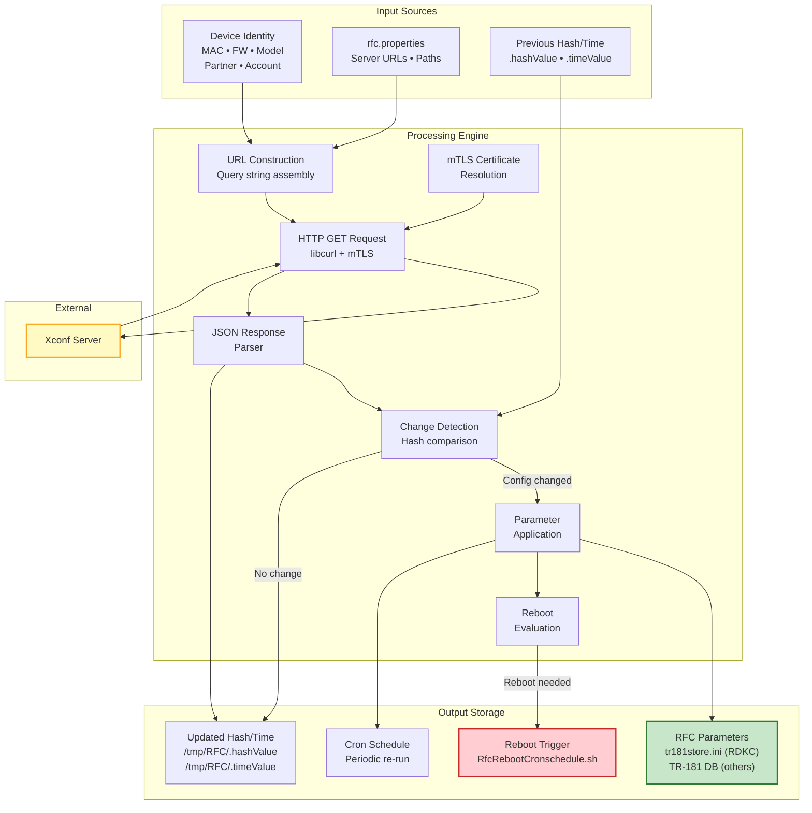
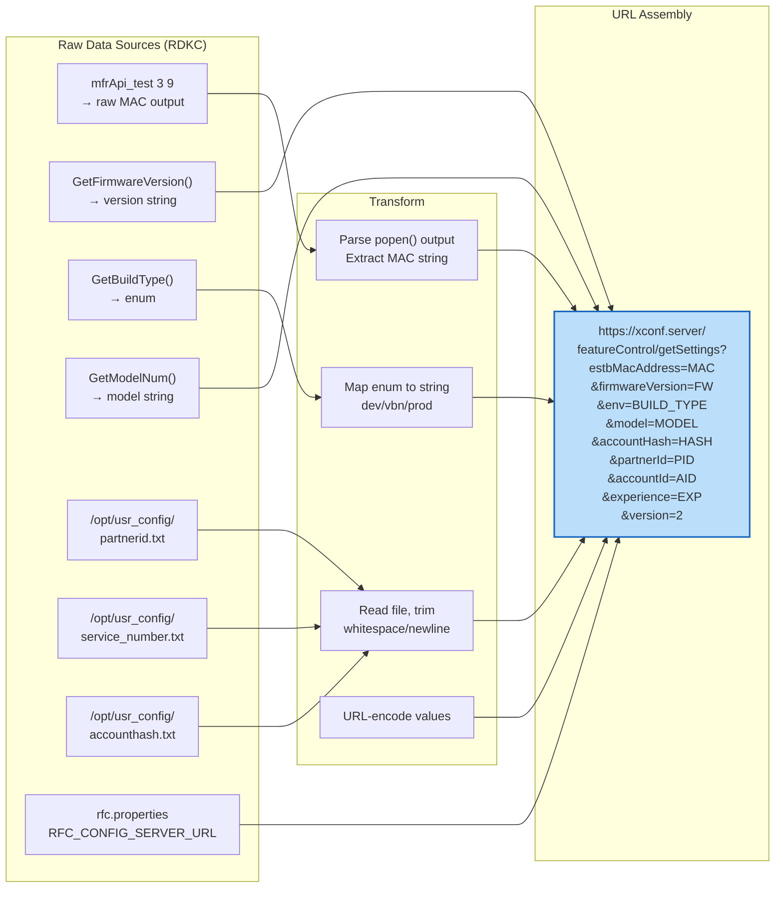
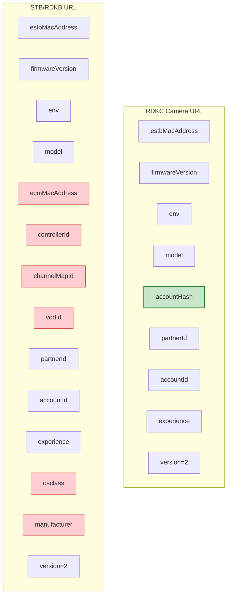
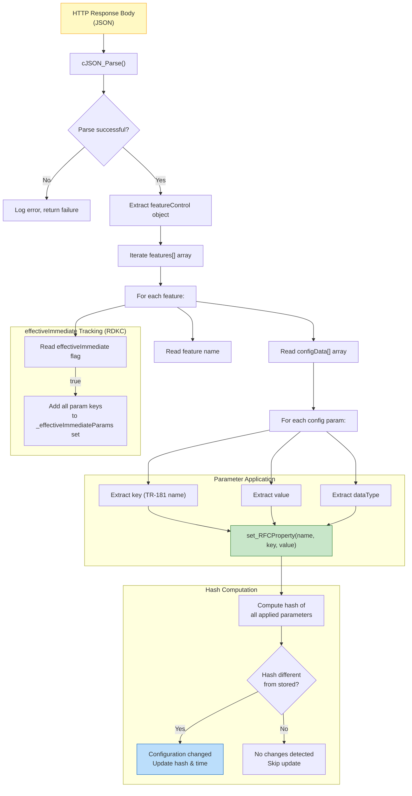
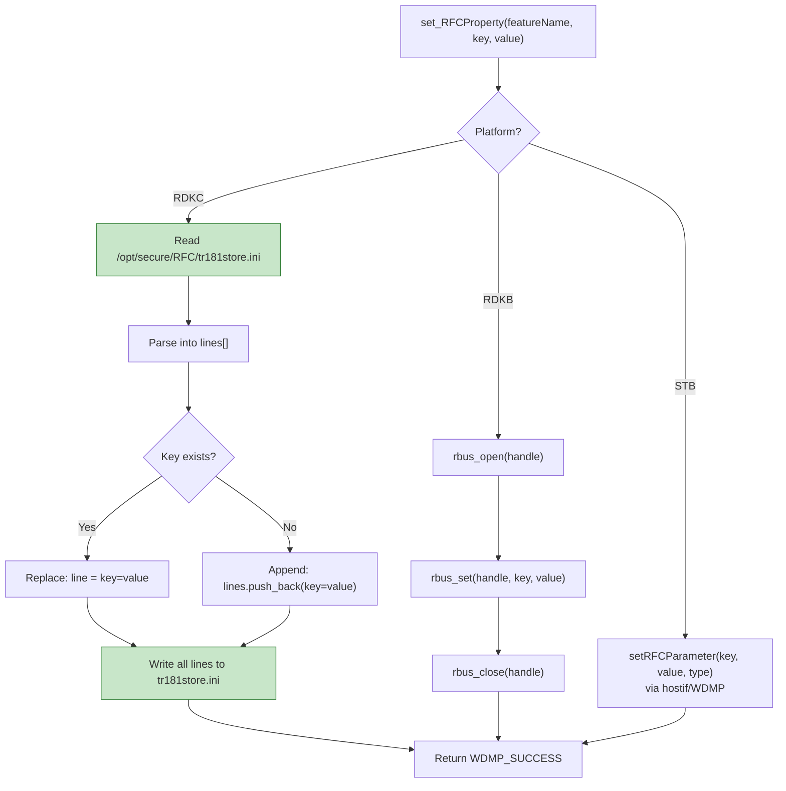
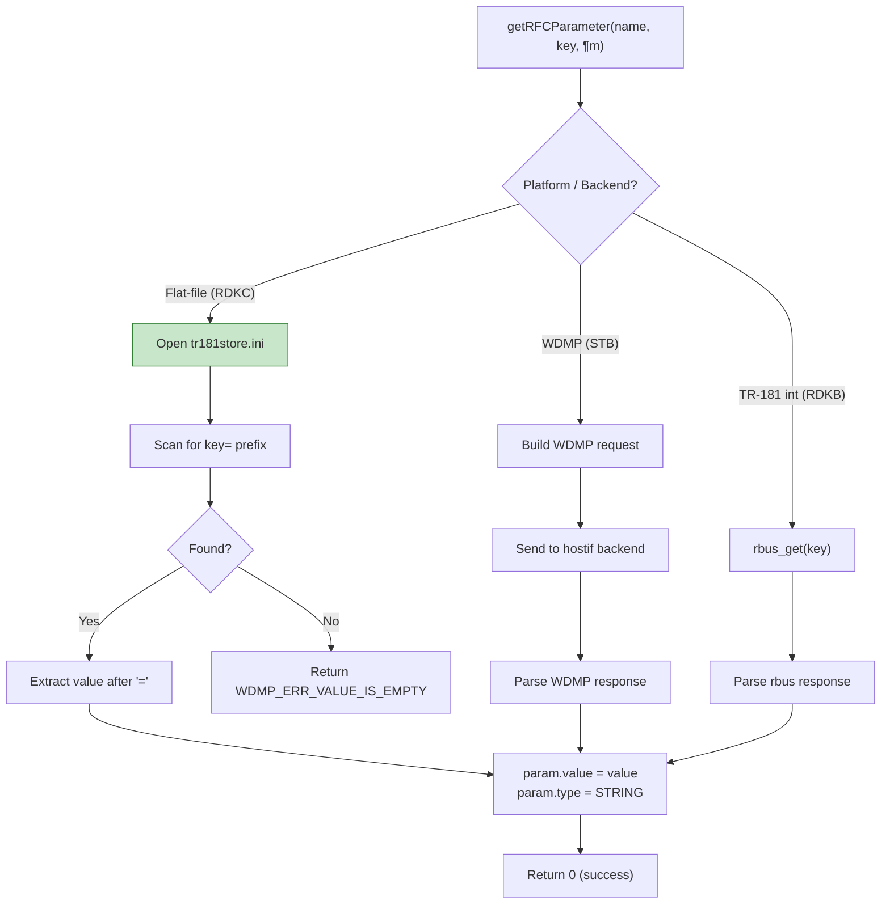
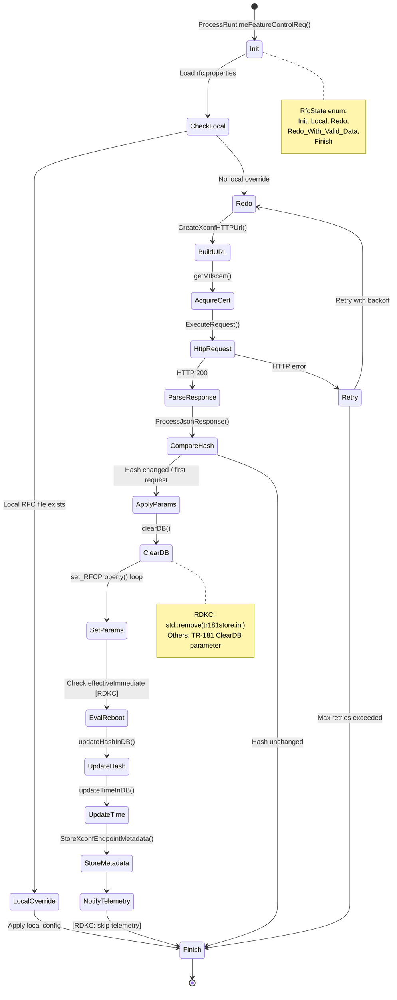
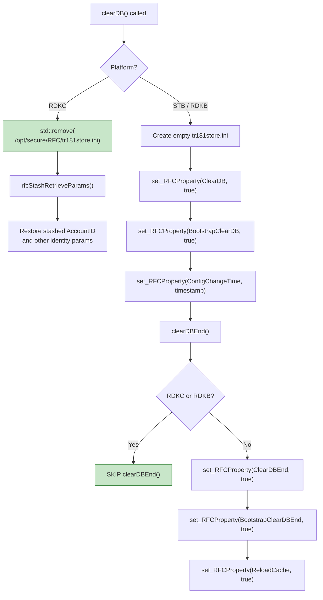
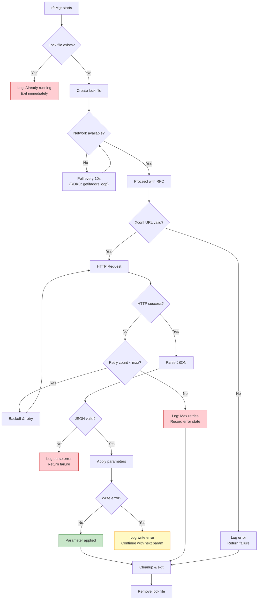

# Data Processing Flow

> Parameter lifecycle, storage strategies, data transformations, and platform-specific data paths for the RFC system.

---

## Table of Contents

- [1. End-to-End Data Flow Overview](#1-end-to-end-data-flow-overview)
- [2. Xconf Request Data Pipeline](#2-xconf-request-data-pipeline)
- [3. Xconf Response Processing Pipeline](#3-xconf-response-processing-pipeline)
- [4. Parameter Storage Architecture](#4-parameter-storage-architecture)
- [5. Hash & Timestamp Management](#5-hash--timestamp-management)
- [6. RFC State Machine](#6-rfc-state-machine)
- [7. ClearDB Data Flow](#7-cleardb-data-flow)
- [8. Platform Data Source Matrix](#8-platform-data-source-matrix)
- [9. Configuration File Formats](#9-configuration-file-formats)
- [10. Error Handling Flow](#10-error-handling-flow)

---

## 1. End-to-End Data Flow Overview

This diagram shows how data flows through the RFC system from external sources to persistent storage.



---

## 2. Xconf Request Data Pipeline

How device data is collected, transformed, and assembled into the Xconf query URL.



### URL Parameter Comparison



> **Green** = RDKC-only field. **Red** = Fields NOT present in RDKC URL.

---

## 3. Xconf Response Processing Pipeline



### JSON Response Structure

```
{
  "featureControl": {
    "features": [
      {
        "name": "AccountInfo",
        "effectiveImmediate": true,
        "enable": true,
        "configData": [
          {
            "key": "Device.X_RDK.AccountID",
            "value": "5789171196032993066",
            "dataType": 0
          },
          {
            "key": "Device.X_RDK.MD5AccountHash",
            "value": "1EMvt8zMMd8muKCBJRnp1z6nZTgsBJ1VhL",
            "dataType": 0
          }
        ]
      }
    ]
  }
}
```

---

## 4. Parameter Storage Architecture

### Write Path



### Read Path (rfcapi)



### File Format: tr181store.ini

```
Device.X_RDK.Feature.AccountInfo.Enable=true
Device.X_RDK.AccountID=5789171196032993066
Device.X_RDK.MD5AccountHash=1EMvt8zMMd8muKCBJRnp1z6nZTgsBJ1VhL
Device.X_RDK.Feature.VideoAnalytics.Enable=true
Device.X_RDK.Feature.AmbientListening.Enable=false
```

---

## 5. Hash & Timestamp Management

```mermaid
flowchart TD
    subgraph "Read Phase"
        R1["GetStoredHashAndTime()"]
        R1 --> R2{"RDKC?"}
        R2 -- Yes --> R3["Always call<br/>RetrieveHashAndTime<br/>FromPreviousDataSet()"]
        R2 -- No --> R4["Check XconfSelector<br/>slot first"]
        R4 --> R5{"Slot matches?"}
        R5 -- Yes --> R6["Read from that slot"]
        R5 -- No --> R3

        R3 --> R7{"RDKC override"}
        R7 --> R8["Read /tmp/RFC/.hashValue<br/>Default: UPGRADE_HASH"]
        R7 --> R9["Read /tmp/RFC/.timeValue<br/>Default: 0"]
    end

    subgraph "Compare Phase"
        CP1["New hash from<br/>current config"] --> CP2{"Hash matches<br/>stored hash?"}
        CP2 -- Yes --> CP3["Config unchanged<br/>Skip parameter apply"]
        CP2 -- No --> CP4["Config changed<br/>Proceed with apply"]
        
        CP5["First request?<br/>(FW changed or<br/>no prior hash)"] --> CP6{"Is first?"}
        CP6 -- Yes --> CP4
        CP6 -- No --> CP2
    end

    subgraph "Write Phase"
        W1["updateHashInDB(hash)"]
        W1 --> W2{"RDKB or RDKC?"}
        W2 -- Yes --> W3["Write /tmp/RFC/.hashValue"]
        W2 -- No --> W4["set_RFCProperty(ConfigSetHash)"]

        W5["updateTimeInDB(time)"]
        W5 --> W6{"RDKB or RDKC?"}
        W6 -- Yes --> W7["Write /tmp/RFC/.timeValue"]
        W6 -- No --> W8["set_RFCProperty(ConfigSetTime)"]
    end

    style R8 fill:#c8e6c9,stroke:#2e7d32
    style R9 fill:#c8e6c9,stroke:#2e7d32
    style W3 fill:#c8e6c9,stroke:#2e7d32
    style W7 fill:#c8e6c9,stroke:#2e7d32
```



### Storage Location Matrix

| Data | STB | RDKB | RDKC |
|------|-----|------|------|
| **Config Hash** | TR-181 DB (`ConfigSetHash`) | `/tmp/RFC/.hashValue` (RAM) | `/tmp/RFC/.hashValue` (RAM) |
| **Config Time** | TR-181 DB (`ConfigSetTime`) | `/tmp/RFC/.timeValue` (RAM) | `/tmp/RFC/.timeValue` (RAM) |
| **Xconf URL** | TR-181 DB (`XconfUrl`) | TR-181 DB | **Not stored** (no-op) |
| **Xconf Selector** | TR-181 DB (`XconfSelector`) | TR-181 DB | **Not stored** (no-op) |

> **Note:** RDKC uses RAM files that do NOT survive reboot. This means every boot is treated as a fresh request, which is intentional for camera devices.

---

## 6. RFC State Machine



---

## 7. ClearDB Data Flow



---

## 8. Platform Data Source Matrix

### Device Identity

| Data Field | STB Source | RDKB Source | RDKC Source |
|------------|-----------|-------------|-------------|
| MAC Address | `GetEstbMac()` → `/tmp/.estb_mac` | `getErouterMac()` | `popen("mfrApi_test 3 9")` |
| Firmware Version | `GetFirmwareVersion()` | `GetFirmwareVersion()` | `GetFirmwareVersion()` |
| Build Type | `GetBuildType()` | `GetBuildType()` | `GetBuildType()` |
| Model Number | `GetModelNum()` | `GetModelNum()` | `GetModelNum()` |
| Manufacturer | `GetMFRName()` | `GetMFRName()` | **Skipped** |
| Partner ID | `GetPartnerId()` → `/opt/partnerid` | `GetPartnerId()` | `fopen("/opt/usr_config/partnerid.txt")` |
| Account ID | `read_RFCProperty()` (TR-181) | `read_RFCProperty()` (rbus) | `ifstream("/opt/usr_config/service_number.txt")` |
| Account Hash | N/A | N/A | `ifstream("/opt/usr_config/accounthash.txt")` |
| ECM MAC | N/A | `geteCMMac()` | N/A |

### Parameter Storage

| Operation | STB | RDKB | RDKC |
|-----------|-----|------|------|
| **Write** | `setRFCParameter()` via hostif | `rbus_set()` | Write to `tr181store.ini` |
| **Read** | `getRFCParameter()` via WDMP | `rbus_get()` | Scan `tr181store.ini` |
| **Clear** | TR-181 ClearDB params | TR-181 ClearDB params | `std::remove(tr181store.ini)` |

### mTLS Certificate

| Strategy | STB | RDKB | RDKC |
|----------|-----|------|------|
| **Primary** | `librdkcertselector` | `librdkcertselector` | Dynamic XPKI (`/opt/certs/devicecert_1.pk12`) |
| **Fallback** | Cert selector retry | Cert selector retry | Static XPKI (`/etc/ssl/certs/staticXpkiCrt.pk12`) |
| **Last resort** | Fail | Fail | Proceed without mTLS |

### Reboot Mechanism

| Aspect | STB | RDKB | RDKC |
|--------|-----|------|------|
| **Trigger** | MaintenanceManager | MaintenanceManager | `RfcRebootCronschedule.sh` |
| **Conditions** | `effectiveImmediate` flag | `effectiveImmediate` flag | `effectiveImmediate` + provisioned + not identity param |
| **Notification** | IARM event | IARM event | Shell script (background) |

---

## 9. Configuration File Formats

### rfc.properties

```properties
# Server endpoints
RFC_CONFIG_SERVER_URL=https://xconf.example.com/featureControl/getSettings
RFC_CONFIG_SERVER_URL_EU=https://xconf-eu.example.com/featureControl/getSettings

# Path configuration
export RFC_RAM_PATH="/tmp/RFC"
TR181_STORE_FILENAME="/opt/secure/RFC/tr181store.ini"
RFC_VAR_FILENAME="/opt/secure/RFC/rfcVariable.ini"
BS_STORE_FILENAME="/opt/secure/RFC/bootstrap.ini"

# Process management
RFC_SERVICE_LOCK="/tmp/.rfcServiceLock"
RFC_WRITE_LOCK="/tmp/.rfcWriteLock"

# Tools & scripts
RFC_WHITELIST_TOOL="rfctool"
RFC_POSTPROCESS="/lib/rdk/RFCpostprocess.sh"
```

### tr181store.ini (RFC Parameters)

```ini
# Format: TR-181_parameter_name=value
Device.X_RDK.Feature.AccountInfo.Enable=true
Device.X_RDK.AccountID=5789171196032993066
Device.X_RDK.MD5AccountHash=1EMvt8zMMd8muKCBJRnp1z6nZTgsBJ1VhL
Device.X_RDK.Feature.VideoAnalytics.Enable=true
```

### .hashValue / .timeValue (RAM files)

```
# /tmp/RFC/.hashValue
a3f2b8c1d4e5f6a7b8c9d0e1f2a3b4c5

# /tmp/RFC/.timeValue
1712937600
```

---

## 10. Error Handling Flow


