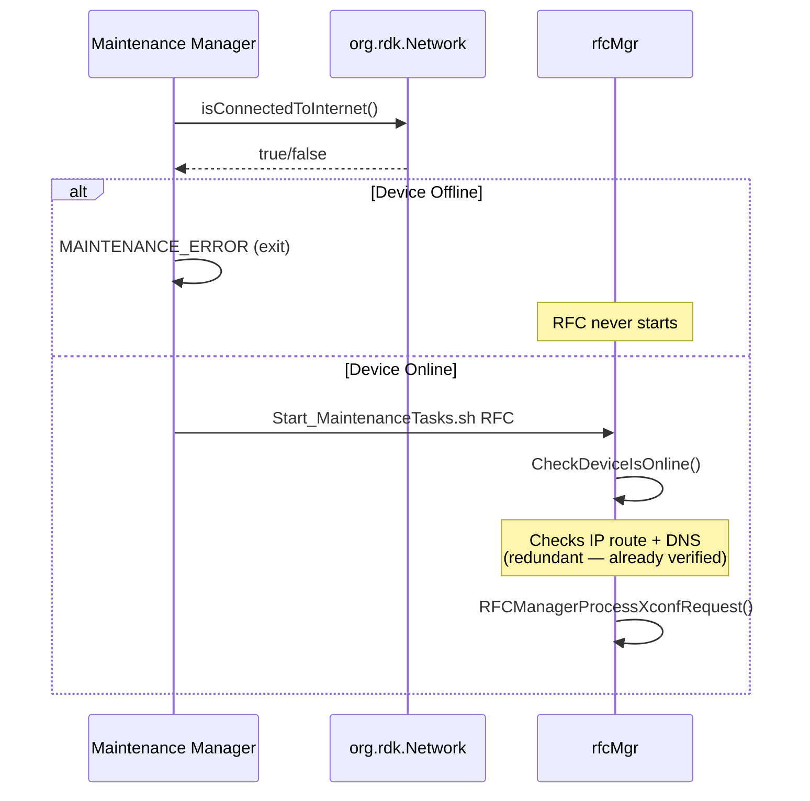
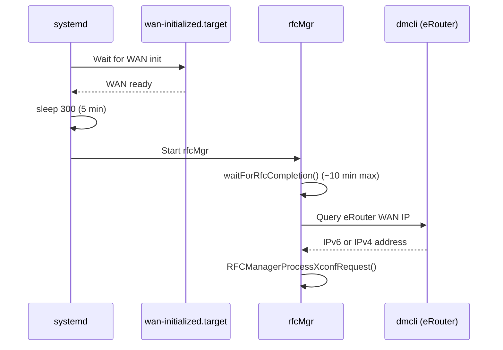
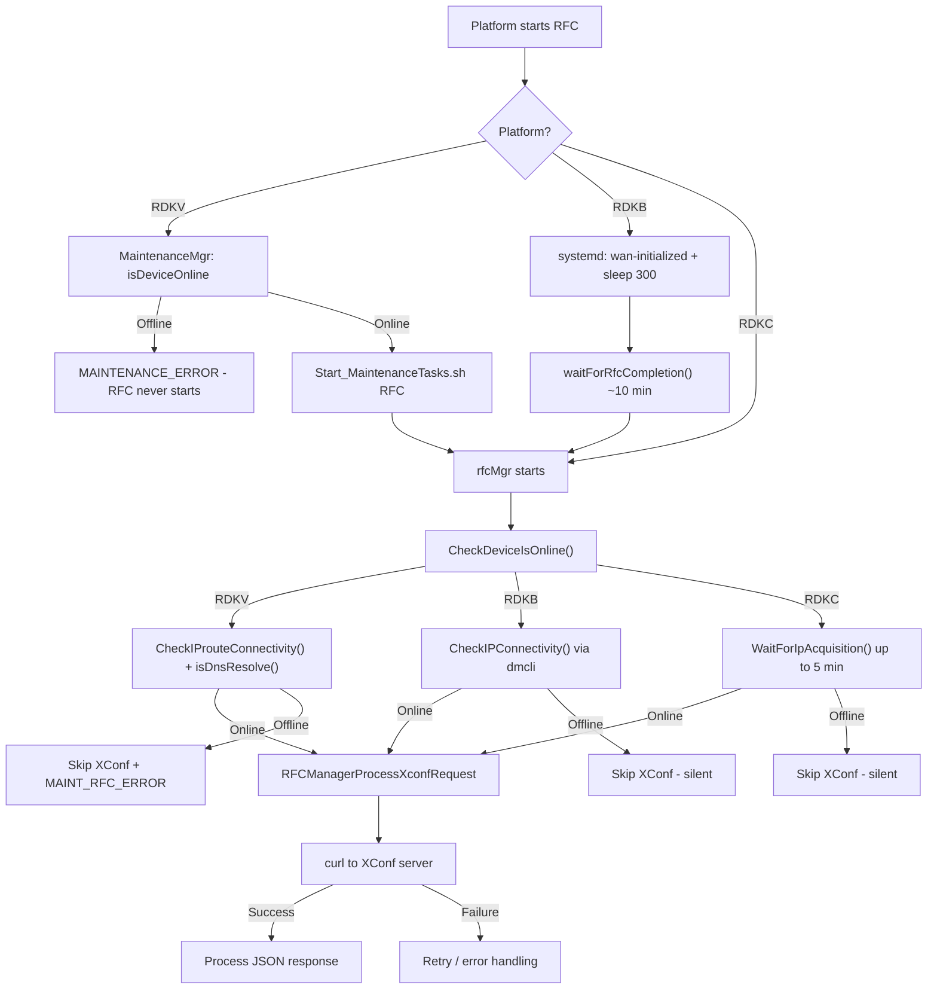

# RFC Module — Internet Connectivity Check Analysis

## Overview

This document analyzes the internet connectivity checks performed inside the RFC Manager (`rfcMgr`) binary, evaluates whether they are redundant given the platform-level guarantees provided by the caller (Maintenance Manager on video devices, `wan-initialized.target` on RDKB), and provides a recommendation.

---

## 1. RFC Manager's Internal Internet Check

### 1.1 Entry Point

In `rfc_main.cpp`, the daemon calls `CheckDeviceIsOnline()` **before** any XConf request:

```c
// rfc_main.cpp:131
rfc::DeviceStatus isDeviceOnline = rfcMgr->CheckDeviceIsOnline();
if (isDeviceOnline == rfc::RFCMGR_DEVICE_ONLINE) {
    status = rfcMgr->RFCManagerProcessXconfRequest();
}
```

If the device is offline, the XConf request is **skipped entirely** and on video platforms an `MAINT_RFC_ERROR` event is sent to the Maintenance Manager.

### 1.2 Platform-Specific Check Logic

`CheckDeviceIsOnline()` uses compile-time flags to select the connectivity test:

```c
// rfc_manager.cpp
DeviceStatus RFCManager::CheckDeviceIsOnline()
{
#ifdef RDKC
    // Camera: Poll getifaddrs() for a routable IP (up to 5 min)
    if (true == WaitForIpAcquisition()) {
        result = RFCMGR_DEVICE_ONLINE;
    }
#elif !defined(RDKB_SUPPORT) && !defined(RDKC)
    // Video (STB/TV): Check IP route file + DNS resolver
    if (true == CheckIProuteConnectivity(GATEWAYIP_FILE)) {
        if (true == isDnsResolve(DNS_RESOLV_FILE)) {
            result = RFCMGR_DEVICE_ONLINE;
        }
    }
#else
    // RDKB (Broadband): Check eRouter WAN IP via dmcli
    if (true == CheckIPConnectivity()) {
        result = RFCMGR_DEVICE_ONLINE;
    }
#endif
    return result;
}
```

### 1.3 Check Details by Platform

| Platform | Compile Flag | Method | What It Checks | Blocking Wait |
|---|---|---|---|---|
| **RDKV (Video)** | `!RDKB_SUPPORT && !RDKC` | `CheckIProuteConnectivity()` + `isDnsResolve()` | Gateway IP route file (`/tmp/.GatewayIP_dfltroute`) + DNS nameserver in `/etc/resolv.dnsmasq` | Polls `/tmp/route_available` every 15 s, up to 5 retries (~75 s max) |
| **RDKB (Broadband)** | `RDKB_SUPPORT` | `CheckIPConnectivity()` | eRouter WAN IPv6/IPv4 via `dmcli` | No blocking wait — single check |
| **RDKC (Camera)** | `RDKC` | `WaitForIpAcquisition()` | `getifaddrs()` for non-loopback, non-link-local IP | Polls every 10 s, up to 30 retries (~5 min max) |

### 1.4 Commented-Out Code

In `CheckIProuteConnectivity()` there is a commented-out block that previously called `checkDeviceInternetConnection()` for an actual HTTP connectivity probe:

```c
/*if (true == checkDeviceInternetConnection(RFC_MGR_INTERNET_CHECK_TIMEOUT))
{
    ip_status = true;
}*/
```

This was disabled, and `ip_status` is now unconditionally set to `true` after the route file check. This means the video platform check only verifies **local network configuration**, not actual internet reachability.

---

## 2. Platform-Level Internet Checks Before RFC Starts

### 2.1 RDKV (Video) — Maintenance Manager

On video devices, RFC is launched as a sub-task of the Maintenance Manager Thunder plugin (`entservices-maintenancemanager`).

The `task_execution_thread()` in `MaintenanceManager.cpp` performs an internet check **before** starting RFC:

```
MaintenanceManager::task_execution_thread()
├── isDeviceOnline()                        ← Network check with retries
│   └── checkNetwork()                      ← Queries org.rdk.Network.1 "isConnectedToInternet"
│       └── 4 retries × 30 s = up to 2 min
├── if (!internetConnectStatus)
│   └── exitOnNoNetwork → MAINTENANCE_ERROR ← Exits entire cycle, RFC never invoked
├── (optional WhoAmI / activation checks)
└── system("Start_MaintenanceTasks.sh RFC &")
    └── rfcMgr                              ← RFC binary starts here
```

**Key point:** The Maintenance Manager calls `org.rdk.Network.1::isConnectedToInternet` which performs an **actual internet reachability test** (not just local IP/route check). If the device is not connected to the internet, the maintenance cycle exits with `MAINTENANCE_ERROR` and RFC is **never invoked**.



### 2.2 RDKB (Broadband) — systemd Service

On broadband devices, RFC starts via a systemd service:

```ini
[Service]
Type=oneshot
ExecStartPre=/bin/sh -c 'sleep 300'
ExecStart=/bin/sh -c '/lib/rdk/rfc.service &'

[Install]
WantedBy=wan-initialized.target
```

**Two layers of network assurance:**

1. **`wan-initialized.target`** — systemd only starts the RFC service after the WAN interface has been initialized
2. **`sleep 300`** — Additional 5-minute delay to allow DHCP, DNS, and upstream connectivity to stabilize

Then inside `rfcMgr`, before `CheckDeviceIsOnline()`:

```c
// rfc_main.cpp (RDKB only)
waitForRfcCompletion();  // Wait for webconfig rfc_blob_processing (up to ~10 min)
```

After all that, `CheckDeviceIsOnline()` calls `CheckIPConnectivity()` which queries the eRouter WAN IP via `dmcli`.



### 2.3 RDKC (Camera) — Standalone

Camera devices run `rfcMgr` directly. There is **no** external pre-check equivalent to the Maintenance Manager or systemd target. The internal `WaitForIpAcquisition()` is the **only** connectivity gate.

---

## 3. Redundancy Analysis

### 3.1 Summary Matrix

| Platform | External Pre-Check | RFC Internal Check | Redundant? | Notes |
|---|---|---|---|---|
| **RDKV (Video)** | Maintenance Manager `isConnectedToInternet()` — actual internet probe with retries | `CheckIProuteConnectivity()` + `isDnsResolve()` — local route/DNS file check | **Yes, largely redundant** | MM already confirmed internet connectivity. RFC's check only verifies local file state, not actual connectivity. |
| **RDKB (Broadband)** | `wan-initialized.target` + `sleep 300` + `waitForRfcCompletion()` | `CheckIPConnectivity()` — eRouter WAN IP via `dmcli` | **Partially redundant** | WAN init + 5 min delay makes IP likely available, but `dmcli` check is a fast sanity validation of WAN state. |
| **RDKC (Camera)** | None | `WaitForIpAcquisition()` — polls for routable IP up to 5 min | **Not redundant** | This is the only connectivity gate. Removal would break RDKC. |

### 3.2 What RFC's Check Actually Validates

The RFC internal check does **not** verify internet connectivity on any platform:

- **RDKV**: Checks for file existence (`/tmp/route_available`, `/tmp/.GatewayIP_dfltroute`, `/etc/resolv.dnsmasq`) and content patterns. The actual `checkDeviceInternetConnection()` HTTP probe is **commented out**.
- **RDKB**: Checks for eRouter WAN IP via `dmcli`. Having a WAN IP does not guarantee internet reachability.
- **RDKC**: Checks for any non-loopback, non-link-local IP via `getifaddrs()`. Again, an IP alone doesn't guarantee reachability.

In all cases, if the check passes but the internet is unreachable, the `curl` call to XConf will fail anyway with a connection timeout, and the error is handled in `DownloadRuntimeFeatures()` / `ProcessRuntimeFeatureControlReq()`.

---

## 4. Current Execution Flow (All Platforms)



---

## 5. Risk Assessment of Removing the Internal Check

### 5.1 If Removed on RDKV

| Risk | Impact | Mitigation |
|---|---|---|
| Race condition: network drops between MM check and RFC start | Low — MM check and RFC start are seconds apart | `curl` to XConf would fail with connection error, handled by retry logic |
| Maintenance Manager not running (standalone test/debug) | Medium — no pre-check, RFC would attempt XConf on potentially offline device | `curl` timeout handles this; log message would be less clear |
| `SendEventToMaintenanceManager(MAINT_RFC_ERROR)` not sent on offline | Low — MM already detected the device was offline in its own check | MM handles this in its own flow |

### 5.2 If Removed on RDKB

| Risk | Impact | Mitigation |
|---|---|---|
| WAN initialized but IP not yet assigned (timing window) | Low — 5 min sleep + webconfig wait make this unlikely | `curl` timeout handles this |
| eRouter loses IP after WAN init | Low | `curl` retry logic handles this |

### 5.3 If Removed on RDKC

| Risk | Impact | Mitigation |
|---|---|---|
| No connectivity gate whatsoever | **High** — camera would immediately attempt XConf on boot before any network is ready | None — this is the only check |

---

## 6. Recommendation

### 6.1 Keep the Internal Check (Recommended)

**The internal internet check should be kept** for the following reasons:

1. **Defense in depth**: The internal check provides a safety net even if the external orchestrator changes or is bypassed (debug, standalone testing, future platforms).

2. **RDKC has no alternative**: Camera devices have no external pre-check. Removing the internal check would break RDKC entirely.

3. **Low cost**: The checks are fast on RDKV/RDKB (file reads, single `dmcli` call). Only RDKC blocks for up to 5 minutes, which is necessary.

4. **Different check semantics**: The Maintenance Manager checks actual internet reachability via `org.rdk.Network`. The RFC internal check validates local network configuration (routes, DNS, WAN IP). These are complementary, not identical.

5. **Error reporting**: The internal check enables RFC-specific logging (`"IP and Route configuration not found"`, `"DNS Nameservers missing"`) and targeted IARM events (`MAINT_RFC_ERROR`) that aid triage.

### 6.2 Suggested Improvements

While the check should be kept, the following improvements would reduce redundancy and improve reliability:

| # | Improvement | Platform | Rationale |
|---|---|---|---|
| 1 | **Uncomment the `checkDeviceInternetConnection()` call** in `CheckIProuteConnectivity()` | RDKV | Currently the check only validates local file state, not actual connectivity. The commented-out HTTP probe would make it a true internet check. |
| 2 | **Add a configurable skip flag** (e.g., TR-181 param or env var) | All | Allow the Maintenance Manager (or other orchestrators) to signal that internet was already verified, letting RFC skip its own check to reduce boot time. |
| 3 | **Reduce `WaitForIpAcquisition()` polling interval** on RDKC from 30 attempts × 10 s to a shorter timeout when triggered by an external orchestrator | RDKC | Future-proofing for when RDKC gains a maintenance manager. |
| 4 | **Add actual DNS resolution test** on RDKB | RDKB | `CheckIPConnectivity()` only verifies WAN IP exists. A DNS test (e.g., resolve the XConf hostname) would catch DNS failures early. |

### 6.3 Architecture Principle

```
┌─────────────────────────────────────────────────────────────┐
│                    Platform Orchestrator                      │
│  (MaintenanceMgr / systemd / standalone)                     │
│                                                              │
│  ► Validates: actual internet reachability                    │
│  ► Decision: start or skip entire maintenance cycle          │
└──────────────────────────┬──────────────────────────────────┘
                           │ RFC is invoked only if online
                           ▼
┌─────────────────────────────────────────────────────────────┐
│                      rfcMgr (RFC Module)                     │
│                                                              │
│  ► Validates: local network prerequisites (route, DNS, IP)   │
│  ► Decision: proceed to XConf or report error                │
│  ► Purpose: defense-in-depth, targeted error reporting       │
└──────────────────────────┬──────────────────────────────────┘
                           │ Network OK
                           ▼
┌─────────────────────────────────────────────────────────────┐
│                    curl → XConf Server                        │
│                                                              │
│  ► Final validation: actual HTTPS connection attempt          │
│  ► Handles: connection timeout, SSL errors, HTTP errors      │
└─────────────────────────────────────────────────────────────┘
```

The three-layer approach (orchestrator → module → curl) provides progressively finer-grained validation and error reporting.

---

## 7. Conclusion

| Question | Answer |
|---|---|
| Is the RFC internal internet check needed? | **Yes**, it should be kept. |
| Is it redundant on RDKV? | Partially — the Maintenance Manager already validates internet connectivity before invoking RFC. However, the internal check validates local network config (routes, DNS) which is complementary. |
| Is it redundant on RDKB? | Partially — `wan-initialized.target` + sleep 300 provides strong network assurance. The `dmcli` WAN IP check is a fast, low-cost sanity validation. |
| Is it redundant on RDKC? | **No** — it is the **only** connectivity gate on camera devices. |
| Should it be removed? | **No**. It provides defense-in-depth, enables RFC-specific error logging, and is the sole gate on RDKC. Cost is negligible on RDKV/RDKB. |

---

## See Also

- [RFC Architecture](architecture.md) — System architecture overview
- [Data Processing Flow](data-processing-flow.md) — XConf request/response lifecycle
- [Sequence Diagrams](sequence-diagrams.md) — RFC communication sequences
- [Maintenance Manager Source](https://github.com/rdkcentral/entservices-maintenancemanager) — Platform orchestrator
- [L2 Test: Device Offline](../test/functional-tests/features/rfc_device_offline_status.feature) — Test for DNS file missing scenario
