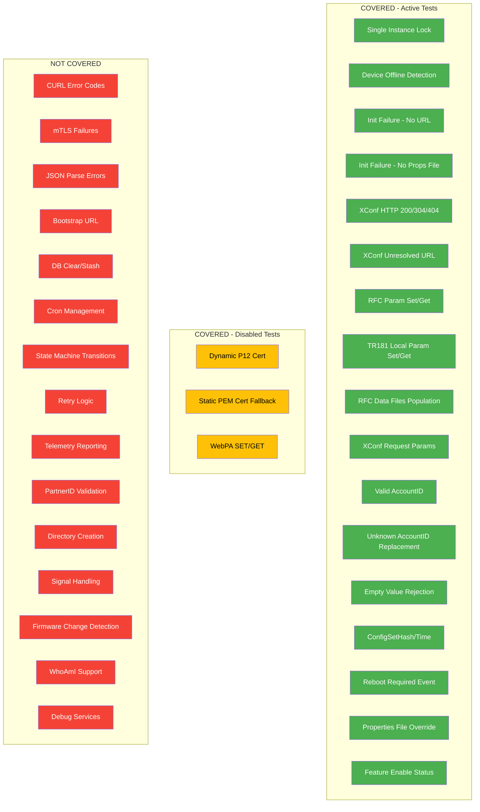
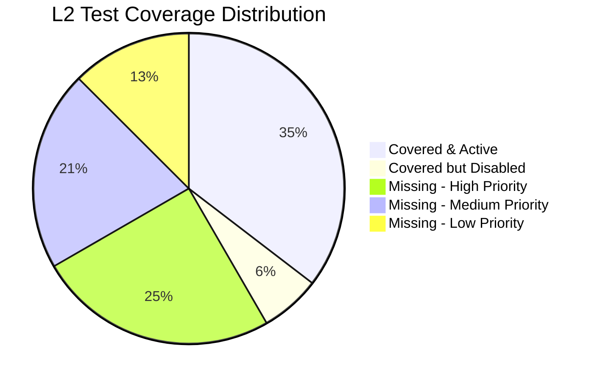

# RFC Module — L2 Functional Test Coverage Analysis

## Overview

This document analyzes the L2 (integration/functional) test coverage for the RFC (Remote Feature Control) module. It maps current test scenarios to source code functionality, identifies coverage gaps, and proposes missing test scenarios.

**Test Framework:** pytest (Python) with Gherkin `.feature` files  
**Test Infrastructure:** Mock XConf HTTPS server (`rfcData.js`), mock parodus binary, Docker container  
**Execution Scripts:** `run_l2.sh` (main), `run_l2_reboot_trigger.sh` (reboot-specific)

---

## 1. Current L2 Test Coverage

### 1.1 Test Inventory

| # | Feature File | Test File | Scenarios | Status in `run_l2.sh` |
|---|---|---|---|---|
| 1 | `rfc_single_instance_run.feature` | `test_rfc_single_instance_run.py` | Lock file prevents second instance | **Active** |
| 2 | `rfc_device_offline_status.feature` | `test_rfc_device_offline_status.py` | DNS file missing → device offline | **Active** |
| 3 | `rfc_initialization_failure.feature` | `test_rfc_initialization_failure.py` | Empty URL; missing properties file | **Active** |
| 4 | `rfc_xconf_communication.feature` | `test_rfc_xconf_communication.py` | Unresolved URL; HTTP 404; HTTP 200 | **Active** |
| 5 | `rfc_setget_param.feature` | `test_rfc_setget_param.py` | RFC param set/get via `tr181` CLI | **Active** |
| 6 | `rfc_tr181_setget_local_param.feature` | `test_rfc_tr181_setget_local_param.py` | Local param set/get via `tr181` CLI | **Active** |
| 7 | `rfc_dynamic_cert_selector.feature` | `test_rfc_dynamic_static_cert_selector.py` | Dynamic P12 cert selection | **Commented out** |
| 8 | `rfc_static_cert_selector.feature` | `test_rfc_static_cert_selector.py` | Static PEM cert fallback | **Commented out** |
| 9 | `rfc_data.feature` | `test_rfc_xconf_rfc_data.py` | RFC data files populated | **Active** |
| 10 | `rfc_xconf_request_params.feature` | `test_rfc_xconf_request_params.py` | XConf query params verification | **Active** |
| 11 | `rfc_valid_accountid.feature` | `test_rfc_valid_accountid.py` | Valid AccountID from XConf | **Active** |
| 12 | `rfc_factory_reset.feature` | `test_rfc_factory_reset.py` | Empty value rejection; PartnerName set | **Active** |
| 13 | `rfc_trigger_reboot.py` | `test_rfc_trigger_reboot.py` | AccountID trigger reboot validation | **Active** |
| 14 | `rfc_feature_enable.feature` | `test_rfc_feature_enable.py` | HTTP 304 handling; feature enable status | **Active** |
| 15 | `rfc_xconf_configsetHash_time.feature` | `test_rfc_xconf_configsethash_time.py` | configSetHash and configSetTime | **Active** |
| 16 | `rfc_reboot_required.feature` | `test_rfc_xconf_reboot.py` | Reboot Required Event to MaintenanceMGR | **Active** |
| 17 | `rfc_override_rfc_prop.feature` | `test_rfc_override_rfc_prop.py` | `/opt/rfc.properties` overrides `/etc/rfc.properties` | **Active** |
| 18 | `rfc_unknown_accountid.feature` | `test_rfc_unknown_accountid.py` | Unknown AccountID → AuthService replacement | **Active** (in `run_l2_reboot_trigger.sh`) |
| 19 | `rfc_webpa.feature` | `test_rfc_webpa.py` | WebPA SET/GET via mock parodus | **Commented out** |

### 1.2 Coverage by Functional Area



### 1.3 Detailed Current Scenario Coverage

#### A. Startup & Initialization

| Scenario | Source Function | Test File | Verified Behavior |
|---|---|---|---|
| Single-instance guard via lock file | `main()` → `CurrentRunningInst()` | `test_rfc_single_instance_run.py` | Second instance blocked when lock held |
| Missing properties file | `GetServURL()` | `test_rfc_initialization_failure.py` | Logs "Failed to open file." + "Xconf Initialization Failed" |
| Empty server URL in properties | `GetServURL()` | `test_rfc_initialization_failure.py` | Logs "URL not found in the file." + "Xconf Initialization Failed" |
| Properties file override | `GetServURL()` → persistent file check | `test_rfc_override_rfc_prop.py` | `/opt/rfc.properties` overrides `/etc/rfc.properties` |

#### B. Device Connectivity

| Scenario | Source Function | Test File | Verified Behavior |
|---|---|---|---|
| DNS file absent → offline | `isDnsResolve()` | `test_rfc_device_offline_status.py` | Logs "dns resolve file: not present" + "RFC:Device is Offline" |

#### C. XConf Communication

| Scenario | Source Function | Test File | Verified Behavior |
|---|---|---|---|
| Unresolvable XConf hostname | `DownloadRuntimeFeatutres()` | `test_rfc_xconf_communication.py` | Logs "Couldn't resolve host name" + curl code 6 |
| HTTP 404 from XConf | `ProcessRuntimeFeatureControlReq()` | `test_rfc_xconf_communication.py` | Logs "cURL Return : 0 HTTP Code : 404" |
| HTTP 200 success | `ProcessRuntimeFeatureControlReq()` | `test_rfc_xconf_communication.py` | Logs "COMPLETED RFC PASS", features enabled, files created |
| HTTP 304 not modified | `ProcessRuntimeFeatureControlReq()` | `test_rfc_feature_enable.py` | Logs 304, features remain active |
| URL percentage encoding | `CreateXconfHTTPUrl()` | `test_rfc_xconf_communication.py` | Encoded URL matches decoded URL |
| XConf request query params | `CreateXconfHTTPUrl()` | `test_rfc_xconf_request_params.py` | All 13 device params present in query |

#### D. RFC Parameter Management

| Scenario | Source Function | Test File | Verified Behavior |
|---|---|---|---|
| Set RFC param via CLI | `setRFCParameter()` | `test_rfc_setget_param.py` | "Set operation success" |
| Get RFC param via CLI | `getRFCParameter()` | `test_rfc_setget_param.py` | Correct value returned |
| Set local TR181 param | `setLocalParam()` | `test_rfc_tr181_setget_local_param.py` | "Set Local Param success!" |
| Get local TR181 param | `getLocalParam()` | `test_rfc_tr181_setget_local_param.py` | Correct value returned |
| Reject empty param value | `processXconfResponseConfigDataPart()` | `test_rfc_factory_reset.py` | Logs "EMPTY value...is rejected" |
| Set PartnerName from XConf | `processXconfResponseConfigDataPart()` | `test_rfc_factory_reset.py` | Value readable via `tr181` CLI |

#### E. AccountID Lifecycle

| Scenario | Source Function | Test File | Verified Behavior |
|---|---|---|---|
| Valid AccountID from XConf | `GetValidAccountId()` | `test_rfc_valid_accountid.py` | AccountID updated, readable via CLI |
| Unknown AccountID → AuthService replacement | `rfcCheckAccountId()` | `test_rfc_unknown_accountid.py` | Unknown replaced with AuthService value |
| AccountID triggers DB update | `isConfigValueChange()` | `test_rfc_trigger_reboot.py` | "AccountId is Valid, Updating the device Database" |

#### F. Reboot & Maintenance

| Scenario | Source Function | Test File | Verified Behavior |
|---|---|---|---|
| Reboot Required Event | `SendEventToMaintenanceManager()` | `test_rfc_xconf_reboot.py` | Logs "RFC: Posting Reboot Required Event to MaintenanceMGR" |

#### G. Configuration Tracking

| Scenario | Source Function | Test File | Verified Behavior |
|---|---|---|---|
| configSetHash from XConf header | `updateHashAndTimeInDB()` | `test_rfc_xconf_configsethash_time.py` | Hash and time values logged and stored |

#### H. Data Persistence

| Scenario | Source Function | Test File | Verified Behavior |
|---|---|---|---|
| RFC data files created | `processXconfResponseConfigDataPart()` | `test_rfc_xconf_rfc_data.py` | `tr181store.ini`, `tr181localstore.ini`, `tr181.list`, `rfcVariable.ini`, `rfcFeature.list` present |

#### I. mTLS / Certificate (Disabled)

| Scenario | Source Function | Test File | Verified Behavior |
|---|---|---|---|
| Dynamic P12 cert selection | `getMtlscert()` + cert selector | `test_rfc_dynamic_static_cert_selector.py` | P12 cert loaded, mTLS enabled | 
| Static PEM cert fallback | `getMtlscert()` + cert selector | `test_rfc_static_cert_selector.py` | Fallback to static PEM cert |

#### J. WebPA (Disabled)

| Scenario | Source Function | Test File | Verified Behavior |
|---|---|---|---|
| WebPA SET via parodus | IARM event handler | `test_rfc_webpa.py` | Parameter set via WebPA succeeds |
| WebPA GET via parodus | IARM event handler | `test_rfc_webpa.py` | Parameter readable via WebPA |

---

## 2. Coverage Gaps — Missing L2 Test Scenarios

### 2.1 Coverage Gap Summary



### 2.2 HIGH Priority — Missing Tests

These test gaps cover critical code paths that affect device behavior in production.

#### GAP-H1: CURL Error Code Handling

**Source:** `NotifyTelemetry2ErrorCode()` in `rfc_xconf_handler.cpp`  
**Untested Error Codes:** 18 (partial transfer), 28 (timeout), 35 (SSL connect error), 51 (SSL peer cert), 53/54/58/59 (SSL cert/key errors), 60 (CA cert), 77 (CA path), 80/82/83/90/91 (SSL-related)  
**Risk:** Incorrect error handling could cause silent failures or infinite retries.

```gherkin
Feature: RFC Manager CURL Error Handling

  Scenario: XConf connection timeout (CURL code 28)
    Given the mockxconf server is configured to delay response by 120 seconds
    When the RFC manager binary is run
    Then an error message "cURL Return : 28 HTTP Code : 0" should be logged
    And an error message "Operation timed out" should be logged
    And the RFC manager should retry the request

  Scenario: SSL certificate verification failure (CURL code 60)
    Given the mockxconf server uses an untrusted certificate
    When the RFC manager binary is run
    Then an error message "cURL Return : 60 HTTP Code : 0" should be logged
    And a telemetry marker "RFC_SSLError" should be reported

  Scenario: SSL connect error (CURL code 35)
    Given the mockxconf server rejects SSL handshake
    When the RFC manager binary is run
    Then an error message "cURL Return : 35 HTTP Code : 0" should be logged
```

#### GAP-H2: Retry Logic with Exponential Behavior

**Source:** `ProcessRuntimeFeatureControlReq()` — 3 retries with sleep(15)  
**Untested:** Whether rfcMgr retries on transient failures and eventually succeeds.

```gherkin
Feature: RFC Manager Retry Logic

  Scenario: XConf server temporarily unavailable then recovers
    Given the mockxconf server returns 503 for the first 2 requests
    And the mockxconf server returns 200 for subsequent requests
    When the RFC manager binary is run
    Then the RFC manager should retry the request
    And the third attempt should succeed with HTTP 200
    And a message "COMPLETED RFC PASS" should be logged

  Scenario: XConf server fails all retry attempts
    Given the mockxconf server is completely unreachable
    When the RFC manager binary is run
    Then the RFC manager should attempt 3 retries
    And a message "Max retry reached" should be logged
```

#### GAP-H3: JSON Response Parse Errors

**Source:** `PreProcessJsonResponse()`, `ProcessJsonResponse()`, `processXconfResponseConfigDataPart()`  
**Untested:** Malformed JSON, missing required fields, truncated responses.

```gherkin
Feature: RFC Manager Malformed XConf Response Handling

  Scenario: XConf returns invalid JSON
    Given the mockxconf server returns "NOT_VALID_JSON{{{" as response body
    When the RFC manager binary is run
    Then an error message indicating JSON parse failure should be logged
    And the RFC manager should not crash

  Scenario: XConf returns JSON missing featureControl key
    Given the mockxconf server returns '{"invalid": "response"}' as response body
    When the RFC manager binary is run
    Then an error message "featureControl not found" should be logged

  Scenario: XConf returns empty features array
    Given the mockxconf server returns '{"featureControl":{"features":[]}}' as response body
    When the RFC manager binary is run
    Then a message "[Features Enabled]-[NONE]:" should be logged

  Scenario: XConf returns feature with missing configData
    Given the mockxconf server returns a feature without configData field
    When the RFC manager binary is run
    Then the feature should be skipped without crashing
```

#### GAP-H4: mTLS Certificate Fetch Failure

**Source:** `DownloadRuntimeFeatutres()` handles `MTLS_CERT_FETCH_FAILURE` and `STATE_RED_CERT_FETCH_FAILURE`  
**Untested:** Behavior when cert selector cannot retrieve any certificate.

```gherkin
Feature: RFC Manager mTLS Certificate Failure

  Scenario: Dynamic certificate retrieval fails completely
    Given no mTLS certificates are available on the device
    And the dynamic certificate source is unavailable
    And the static certificate file does not exist
    When the RFC manager binary is run
    Then an error message "MTLS cert fetch failure" should be logged
    And a telemetry marker "MTLS_CERT_FETCH_FAILURE" should be reported

  Scenario: State Red certificate fallback
    Given the device is in State Red mode
    And the primary mTLS certificates are unavailable
    When the RFC manager binary is run
    Then the State Red certificate should be used for XConf communication
```

#### GAP-H5: Bootstrap XConf URL

**Source:** `GetBootstrapXconfUrl()` — reads bootstrap URL with retry (10 attempts, 10s each)  
**Untested:** Bootstrap URL overriding default URL, and bootstrap URL fetch retry.

```gherkin
Feature: RFC Manager Bootstrap XConf URL

  Scenario: Bootstrap XConf URL overrides default URL
    Given the bootstrap configuration contains a custom XConf URL "https://custom-xconf:50053/featureControl/getSettings"
    And the RFC properties file contains the default XConf URL
    When the RFC manager binary is run
    Then the XConf request should be sent to "https://custom-xconf:50053/featureControl/getSettings"
    And a message "Boot strap XConf URL" should be logged

  Scenario: Bootstrap URL retrieval retries on failure
    Given the bootstrap configuration is initially unavailable
    And the bootstrap becomes available after 3 attempts
    When the RFC manager binary is run
    Then a message indicating bootstrap retry should be logged
    And the bootstrap XConf URL should eventually be used
```

#### GAP-H6: PartnerID Validation and Change Detection

**Source:** `GetValidPartnerId()`, `GetRFCPartnerID()`  
**Untested:** PartnerID change from "unknown" to valid (triggers reboot), special character rejection, WhoAmI-aware partner lookup.

```gherkin
Feature: RFC Manager PartnerID Handling

  Scenario: PartnerID changes from unknown to valid
    Given the device PartnerID is currently "unknown"
    When the RFC manager receives a valid PartnerID "comcast" from XConf
    Then a message "PartnerID Updated" should be logged
    And a reboot should be triggered

  Scenario: PartnerID with special characters is rejected
    Given the mockxconf server returns PartnerID "partner<script>"
    When the RFC manager binary is run
    Then the PartnerID should be rejected
    And a message about special characters should be logged

  Scenario: WhoAmI-aware PartnerID retrieval
    Given the device supports WhoAmI
    And the WhoAmI service returns PartnerID "sky"
    When the RFC manager binary is run
    Then the XConf request should contain partnerId "sky"
```

#### GAP-H7: DB Clear and Stash/Retrieve on Firmware Change

**Source:** `clearDB()`, `rfcStashStoreParams()`, `rfcStashRetrieveParams()`, `IsNewFirmwareFirstRequest()`  
**Untested:** Database clear on firmware upgrade, AccountID preservation across DB clear.

```gherkin
Feature: RFC Manager Firmware Change Handling

  Scenario: New firmware triggers DB clear and re-fetch
    Given the device was previously running firmware "v1.0"
    And the device is now running firmware "v2.0"
    When the RFC manager binary is run
    Then a message "New Firmware First Request" should be logged
    And the RFC database should be cleared
    And the AccountID should be preserved (stashed and retrieved)
    And XConf should be re-queried with fresh state

  Scenario: Same firmware skips DB clear
    Given the device firmware has not changed since last RFC run
    When the RFC manager binary is run
    Then the RFC database should not be cleared
    And the existing configuration should be reused
```

#### GAP-H8: Maintenance Manager Integration

**Source:** `SendEventToMaintenanceManager()` with events `MAINT_RFC_INPROGRESS`, `MAINT_RFC_COMPLETE`, `MAINT_RFC_ERROR`, `MAINT_CRITICAL_UPDATE`  
**Untested:** Full event lifecycle (in-progress → complete/error), error event on failure.

```gherkin
Feature: RFC Manager Maintenance Manager Event Lifecycle

  Scenario: Successful RFC processing sends complete event
    Given ENABLE_MAINTENANCE is set to true in device.properties
    When the RFC manager successfully processes XConf response
    Then a message "MAINT_RFC_INPROGRESS" should be logged before processing
    And a message "MAINT_RFC_COMPLETE" should be logged after processing

  Scenario: Failed RFC processing sends error event
    Given ENABLE_MAINTENANCE is set to true in device.properties
    And the XConf server is unreachable
    When the RFC manager binary is run
    Then a message "MAINT_RFC_ERROR" should be logged

  Scenario: Maintenance disabled skips event broadcast
    Given ENABLE_MAINTENANCE is set to false in device.properties
    When the RFC manager binary is run
    Then no maintenance manager events should be broadcast
```

#### GAP-H9: configSetHash Change Detection and Reboot Trigger

**Source:** `updateHashAndTimeInDB()`, `getRebootRequirement()`  
**Untested:** Hash change between runs triggers reboot, hash unchanged skips reboot.

```gherkin
Feature: RFC Manager ConfigSetHash Change Detection

  Scenario: ConfigSetHash change triggers reboot requirement
    Given the stored configSetHash is "OLDhashValue"
    And the mockxconf server returns configSetHash "NEWhashValue" in response header
    When the RFC manager binary is run
    Then a message "Config Set Hash changed" should be logged
    And a message "RFC: Posting Reboot Required Event to MaintenanceMGR" should be logged

  Scenario: ConfigSetHash unchanged skips reboot
    Given the stored configSetHash matches the XConf response hash
    When the RFC manager binary is run
    Then no reboot requirement should be set
    And no "Posting Reboot Required Event" message should be logged
```

#### GAP-H10: Config Value Change Detection

**Source:** `isConfigValueChange()` — compares current vs XConf values for bootstrap, RFC namespace, and non-RFC params  
**Untested:** Change detection across different param namespaces.

```gherkin
Feature: RFC Manager Config Value Change Detection

  Scenario: Bootstrap parameter value changes
    Given the bootstrap param "OsClass" is currently "default"
    When XConf returns OsClass value "enterprise"
    Then a message "Config Value changed" should be logged
    And the new value should be stored in the RFC database

  Scenario: RFC parameter value unchanged
    Given the RFC param "Feature.AccountInfo.AccountID" is already "3064488088886635972"
    When XConf returns the same AccountID value
    Then a message "No Config change" should be logged
    And the database should not be updated

  Scenario: Non-RFC namespace parameter processing
    Given XConf returns a parameter without "tr181." prefix
    When the RFC manager processes the response
    Then the parameter should be treated as a bootstrap parameter
```

#### GAP-H11: XConf Selector (Prod/CI/Automation) Slot Processing

**Source:** `GetXconfSelect()`, `isXconfSelectorSlotProd()`  
**Untested:** Different XConf selector values changing processing behavior.

```gherkin
Feature: RFC Manager XConf Selector Slot

  Scenario: XConfSelector set to "prod" processes production features
    Given the XConfSelector TR181 param is set to "prod"
    When the RFC manager binary is run
    Then features should be processed in production mode
    And a message "[Features Enabled]-[STAGING]:" should be logged

  Scenario: XConfSelector set to "ci" processes CI features
    Given the XConfSelector TR181 param is set to "ci"
    When the RFC manager binary is run
    Then features should be processed in CI mode

  Scenario: XConfSelector set to "automation" uses automation slot
    Given the XConfSelector TR181 param is set to "automation"
    When the RFC manager binary is run
    Then features should be processed in automation mode
```

#### GAP-H12: IsDirectBlocked — 24-Hour Block After Failure

**Source:** `IsDirectBlocked()` in `rfc_xconf_handler.cpp`  
**Untested:** Direct-fail blocking mechanism that prevents repeated failures.

```gherkin
Feature: RFC Manager Direct Block on Repeated Failures

  Scenario: Direct block active within 24 hours of last failure
    Given the RFC manager previously failed with a direct error
    And the failure occurred less than 24 hours ago
    When the RFC manager binary is run
    Then a message "Direct Blocked" should be logged
    And no XConf request should be made

  Scenario: Direct block expired after 24 hours
    Given the RFC manager previously failed with a direct error
    And the failure occurred more than 24 hours ago
    When the RFC manager binary is run
    Then the direct block should be cleared
    And a normal XConf request should be made
```

---

### 2.3 MEDIUM Priority — Missing Tests

#### GAP-M1: Cron Job Management

**Source:** `manageCronJob()`, `getCronFromDCMSettings()`

```gherkin
Feature: RFC Manager Cron Job Management

  Scenario: Valid cron string from DCM settings is applied
    Given the DCMSettings.conf contains cron "30 2 * * *"
    When the RFC manager processes DCM cron settings
    Then the cron should be adjusted by -3 minutes to "27 2 * * *"
    And the adjusted cron should be written to crontab

  Scenario: Cron minute adjustment with hour underflow
    Given the DCMSettings.conf contains cron "1 0 * * *"
    When the RFC manager processes DCM cron settings
    Then the cron should be adjusted to "58 23 * * *"

  Scenario: Invalid cron format is rejected
    Given the DCMSettings.conf contains invalid cron "INVALID"
    When the RFC manager processes DCM cron settings
    Then the cron should not be applied
    And an error should be logged
```

#### GAP-M2: Telemetry Reporting

**Source:** `NotifyTelemetry2Count()`, `NotifyTelemetry2Value()`, `NotifyTelemetry2RemoteFeatures()`, `NotifyTelemetry2ErrorCode()`

```gherkin
Feature: RFC Manager Telemetry Reporting

  Scenario: Successful RFC processing reports telemetry markers
    Given all the properties to run RFC manager is available and running
    When the RFC manager binary successfully processes XConf response
    Then telemetry markers for active features should be reported
    And a telemetry count for "RFC_COMPLETED" should be incremented

  Scenario: CURL errors report telemetry error codes
    Given the mockxconf server is unreachable
    When the RFC manager binary is run
    Then a telemetry error marker for the CURL error code should be reported
```

#### GAP-M3: Directory Creation on First Boot

**Source:** `createDirectoryIfNotExists()` in `rfc_main.cpp`

```gherkin
Feature: RFC Manager Directory Creation

  Scenario: SECURE_RFC_PATH created on first boot
    Given the directory "/opt/secure/RFC" does not exist
    When the RFC manager binary is run
    Then the directory "/opt/secure/RFC" should be created with permissions 0755
    And the RFC manager should continue processing

  Scenario: SECURE_RFC_PATH creation failure exits
    Given the parent directory "/opt/secure" is read-only
    When the RFC manager binary is run
    Then the RFC manager should exit with failure
```

#### GAP-M4: Signal Handling (SIGINT/SIGTERM)

**Source:** `signal_handler()` in `rfc_main.cpp`

```gherkin
Feature: RFC Manager Signal Handling

  Scenario: SIGTERM graceful shutdown
    Given the RFC manager binary is running
    When a SIGTERM signal is sent to the RFC manager
    Then the lock file "/tmp/.rfcServiceLock" should be removed
    And the RFC manager should exit cleanly

  Scenario: SIGINT graceful shutdown
    Given the RFC manager binary is running
    When a SIGINT signal is sent to the RFC manager
    Then the lock file "/tmp/.rfcServiceLock" should be removed
    And the RFC manager should exit cleanly
```

#### GAP-M5: IP Route Connectivity Check with Retry

**Source:** `CheckIProuteConnectivity()` — 5 retries with 15s sleep  
**Untested:** IP route file becomes available after retry.

```gherkin
Feature: RFC Manager IP Route Connectivity Check

  Scenario: IP route file available on first check
    Given the IP route file "/tmp/route_available" exists with valid IPv4 entry
    When the RFC manager checks device connectivity
    Then the device should be marked as online

  Scenario: IP route file becomes available after retries
    Given the IP route file does not initially exist
    And the IP route file is created after 30 seconds
    When the RFC manager checks device connectivity
    Then the device should retry up to 5 times
    And the device should eventually be marked as online

  Scenario: IP route file never appears
    Given the IP route file never appears within the retry window
    When the RFC manager checks device connectivity
    Then the device should be marked as offline after 5 attempts
```

#### GAP-M6: Feature List File Processing (JSON Array Extraction)

**Source:** `iterateAndSaveArrayNodes()`, `saveToFile()` in `jsonhandler.cpp`

```gherkin
Feature: RFC Manager Feature List File Processing

  Scenario: JSON list features are saved to separate files
    Given the XConf response contains features with listType arrays
    When the RFC manager processes the response
    Then each list should be saved as a separate .ini file under /opt/secure/RFC
    And each file should contain one array item per line
```

#### GAP-M7: rfcVariable.ini and rfcFeature.list Population

**Source:** `WriteFile()`, `writeRemoteFeatureCntrlFile()`

```gherkin
Feature: RFC Manager Feature Tracking Files

  Scenario: rfcVariable.ini populated with feature variables
    Given the mockxconf server returns features with configData
    When the RFC manager binary is run
    Then the file "/opt/secure/RFC/rfcVariable.ini" should contain all feature key-value pairs

  Scenario: rfcFeature.list populated with feature names
    Given the mockxconf server returns multiple features
    When the RFC manager binary is run
    Then the file "/opt/secure/RFC/rfcFeature.list" should list all feature names
```

#### GAP-M8: IARM Bus Event Handler Registration

**Source:** `InitializeIARM()`, `term_event_handler()`

```gherkin
Feature: RFC Manager IARM Bus Integration

  Scenario: IARM bus initialization success
    Given the IARM bus daemon is running
    When the RFC manager starts
    Then IARM initialization should succeed
    And event handlers should be registered

  Scenario: IARM bus initialization failure
    Given the IARM bus daemon is not running
    When the RFC manager starts
    Then IARM initialization failure should be logged
    And the RFC manager should continue without IARM functionality
```

#### GAP-M9: eRouter IP Address Resolution

**Source:** `getErouterIPAddress()`, `CheckIPConnectivity()`

```gherkin
Feature: RFC Manager eRouter IP Connectivity

  Scenario: IPv6 WAN address available
    Given the eRouter has a valid IPv6 WAN address
    When the RFC manager checks IP connectivity
    Then the device should be marked as online using IPv6

  Scenario: IPv4 fallback when IPv6 unavailable
    Given the eRouter has no IPv6 WAN address
    And the eRouter has a valid IPv4 WAN address
    When the RFC manager checks IP connectivity
    Then the device should fall back to IPv4
    And the device should be marked as online

  Scenario: No WAN address available
    Given the eRouter has no IPv4 or IPv6 WAN address
    When the RFC manager checks IP connectivity
    Then the device should be marked as offline
```

#### GAP-M10: Post-Process Script Execution

**Source:** `RFCManagerPostProcess()`

```gherkin
Feature: RFC Manager Post-Processing

  Scenario: Post-process script executed after successful RFC processing
    Given the post-process script exists at the expected path
    When the RFC manager completes XConf processing
    Then the post-process script should be executed
    And a message "RFCManagerPostProcess" should be logged

  Scenario: Post-process script missing is handled gracefully
    Given no post-process script exists
    When the RFC manager completes XConf processing
    Then the missing script should be skipped without error
```

---

### 2.4 LOW Priority — Missing Tests

#### GAP-L1: Debug Services Unlock Check

**Source:** `isSecureDbgSrvUnlocked()` — multi-factor check (build type + LABSIGNED + device type + RFC flag)

```gherkin
Feature: RFC Manager Debug Services Check

  Scenario: Debug services enabled for lab-signed test device
    Given the build type is "VBN"
    And LABSIGNED_ENABLED is true
    And DeviceType is "test"
    And DbgServices.Enable is true
    When the RFC manager checks debug services
    Then debug services should be enabled

  Scenario: Debug services blocked for production device
    Given the build type is "PROD"
    When the RFC manager checks debug services
    Then debug services should be disabled
```

#### GAP-L2: WhoAmI Support Integration

**Source:** `checkWhoamiSupport()`, `GetRFCPartnerID()`, `GetOsClass()`

```gherkin
Feature: RFC Manager WhoAmI Support

  Scenario: WhoAmI supported device uses WhoAmI for partner and OS class
    Given the device supports WhoAmI
    When the RFC manager initializes
    Then PartnerID should be retrieved via WhoAmI
    And OsClass should be retrieved via WhoAmI
```

#### GAP-L3: JSON-RPC to AuthService (Experience/Token)

**Source:** `getJsonRpc()`, `getJRPCTokenData()`, `GetExperience()`

```gherkin
Feature: RFC Manager AuthService JSON-RPC Integration

  Scenario: Experience value retrieved via JSON-RPC
    Given the WPEFramework AuthService is running
    When the RFC manager queries for Experience
    Then the Experience value should be included in XConf request parameters

  Scenario: AuthService unavailable falls back to default
    Given the WPEFramework AuthService is not running
    When the RFC manager queries for Experience
    Then a default Experience value should be used
```

#### GAP-L4: RFC Parameter Type Handling in `ParseConfigValue`

**Source:** `ParseConfigValue()` — handles boolean, int, unsigned int, unsigned long, float, double, string types

```gherkin
Feature: RFC Manager Parameter Type Detection

  Scenario Outline: XConf sets parameter with correct type detection
    Given the mockxconf server returns param "<param>" with value "<value>"
    When the RFC manager processes the response
    Then the parameter should be stored with type "<expected_type>"

    Examples:
      | param                              | value  | expected_type |
      | Feature.TestBool.Enable            | true   | boolean       |
      | Feature.TestInt.Value              | 42     | int           |
      | Feature.TestFloat.Value            | 3.14   | float         |
      | Feature.TestString.Name            | hello  | string        |
```

#### GAP-L5: Cleanup of `.RFC_*` Files

**Source:** `cleanAllFile()` — removes `.RFC_*` files and `rfcVariable.ini`

```gherkin
Feature: RFC Manager File Cleanup

  Scenario: Old RFC files cleaned on fresh XConf processing
    Given old ".RFC_*" files exist in /opt/secure/RFC
    When the RFC manager processes a new XConf response
    Then old ".RFC_*" files should be removed
    And new files should be created from the current response
```

#### GAP-L6: Scheduled Reboot Cron (RDKB-specific)

**Source:** `HandleScheduledReboot()`

```gherkin
Feature: RFC Manager Scheduled Reboot

  Scenario: Scheduled reboot script executed when needed
    Given the XConf response requires a scheduled reboot
    When the RFC manager processes the response
    Then "/etc/RfcRebootCronschedule.sh" should be executed
```

---

## 3. Coverage Matrix

### 3.1 Source File Coverage

| Source File | Functions | L2 Tested | Coverage |
|---|---|---|---|
| `rfc_main.cpp` | 4 | 2 (lock file, main flow) | ~50% |
| `rfc_manager.cpp` | 12 | 4 (online check, reboot event, post-process, xconf request) | ~33% |
| `rfc_common.cpp` | 8 | 1 (read_RFCProperty indirect) | ~12% |
| `rfc_xconf_handler.cpp` | ~45 | 15 (XConf flow, account ID, hash, params, features) | ~33% |
| `xconf_handler.cpp` | 2 | 1 (initialization indirect) | ~50% |
| `mtlsUtils.cpp` | 4 | 2 (disabled tests) | 0% active |
| `rfcapi.cpp` | 8 | 2 (set/get RFC param) | ~25% |
| `tr181api.cpp` | 10 | 2 (set/get local param) | ~20% |
| `jsonhandler.cpp` | 7 | 1 (indirect via data files) | ~14% |
| `tr181utils.cpp` | 8 | 2 (CLI get/set used in tests) | ~25% |

### 3.2 Error Path Coverage

| Error Category | Total Paths | Covered | Gap |
|---|---|---|---|
| CURL error codes | 15+ | 2 (code 0, code 6) | 13+ paths |
| JSON parse failures | 6 | 0 | 6 paths |
| File I/O failures | 8 | 2 (missing props, empty URL) | 6 paths |
| mTLS cert failures | 3 | 0 (disabled) | 3 paths |
| IARM failures | 4 | 0 | 4 paths |
| Type conversion errors | 5 | 0 | 5 paths |
| Semaphore failures | 4 | 0 | 4 paths |

### 3.3 Feature Branch Coverage

| Compile Flag | Active Tests | Gap |
|---|---|---|
| Default (video) path | All active tests | Baseline |
| `RDKB_SUPPORT` | 0 | Entire RDKB-specific paths untested |
| `RDKB_EXTENDER_SUPPORT` | 0 | Extender MAC retrieval untested |
| `EN_MAINTENANCE_MANAGER` | 1 (reboot event) | In-progress, complete, error events untested |
| `LIBRDKCERTSELECTOR` | 0 (disabled) | Cert selector integration untested |
| `WHOAMI_SUPPORT` | 0 | WhoAmI partner/OS class untested |

---

## 4. Recommended Test Implementation Priority

### Phase 1 — Critical (Immediate)

| Priority | Gap ID | Test Scenario | Effort |
|---|---|---|---|
| P1 | GAP-H3 | Malformed JSON response handling | Medium — requires mock server changes |
| P2 | GAP-H1 | CURL error code 28 (timeout) | Medium — mock server delay config |
| P3 | GAP-H2 | Retry logic (transient failure recovery) | Medium — stateful mock server |
| P4 | GAP-H9 | ConfigSetHash change → reboot | Low — modify stored hash before run |
| P5 | GAP-H10 | Config value change detection | Low — pre-populate params, compare |

### Phase 2 — Important (Next Sprint)

| Priority | Gap ID | Test Scenario | Effort |
|---|---|---|---|
| P6 | GAP-H7 | Firmware change → DB clear + stash | Medium — version file manipulation |
| P7 | GAP-H6 | PartnerID validation and change | Low — mock response variation |
| P8 | GAP-H8 | Maintenance Manager event lifecycle | Low — log verification |
| P9 | GAP-M5 | IP route retry connectivity | Medium — timed file creation |
| P10 | GAP-M1 | Cron job management | Low — DCMSettings.conf setup |

### Phase 3 — Enhancement (Backlog)

| Priority | Gap ID | Test Scenario | Effort |
|---|---|---|---|
| P11 | GAP-H4 | mTLS cert fetch failure | High — cert infrastructure |
| P12 | GAP-H5 | Bootstrap XConf URL | Medium — bootstrap file setup |
| P13 | GAP-H11 | XConf selector slot processing | Low — TR181 param setup |
| P14 | GAP-H12 | 24-hour direct block | Medium — timestamp manipulation |
| P15 | GAP-M2 | Telemetry marker reporting | Medium — telemetry mock |

---

## 5. Mock Server Enhancement Requirements

To support the missing test scenarios, the mock XConf server (`rfcData.js`) needs:

### 5.1 New Response Endpoints

| Endpoint | Purpose | Gap |
|---|---|---|
| `/featureControl/timeout` | Delayed response (>120s) | GAP-H1 |
| `/featureControl/503retry` | Returns 503 first N times, then 200 | GAP-H2 |
| `/featureControl/malformed` | Returns invalid JSON | GAP-H3 |
| `/featureControl/emptyFeatures` | Returns `{"featureControl":{"features":[]}}` | GAP-H3 |
| `/featureControl/noConfigData` | Returns features without configData | GAP-H3 |
| `/featureControl/changedHash` | Returns response with different configSetHash | GAP-H9 |
| `/featureControl/partnerChange` | Returns changed PartnerID | GAP-H6 |

### 5.2 New Mock XConf Response Files

```
test/test-artifacts/mockxconf/
├── xconf-rfc-response.json                          # (existing)
├── xconf-rfc-response-unknown-accountid.json        # (existing)
├── xconf-rfc-response-malformed.json                # NEW: invalid JSON
├── xconf-rfc-response-empty-features.json           # NEW: empty features
├── xconf-rfc-response-no-configdata.json            # NEW: missing configData
├── xconf-rfc-response-partner-change.json           # NEW: changed PartnerID
├── xconf-rfc-response-special-chars.json            # NEW: special chars in IDs
└── xconf-rfc-response-type-variants.json            # NEW: various param types
```

---

## 6. Issues Found in Existing Tests

| Issue | File | Description |
|---|---|---|
| Duplicate feature files | `rfc_xconf_communication.feature` and `rfc_xconf_configsetHash_time.feature` | Identical content — `configsetHash_time` should have unique scenarios |
| Wrong file extension | `rfc_trigger_reboot.py` in `features/` dir | Should be `.feature` if using Gherkin, or moved to `tests/` if Python |
| Feature/test mismatch | `rfc_dynamic_cert_selector.feature` | Feature title says "Static" but filename says "dynamic" |
| Disabled critical tests | `test_rfc_webpa.py`, cert tests | Commented out in `run_l2.sh` without tracking issue |
| No negative RFC API tests | `test_rfc_setget_param.py` | Missing: invalid param name, wildcard rejection, non-existent param |
| No clear param test | `test_rfc_tr181_setget_local_param.py` | `clearLocalParam()` not tested |

---

## 7. Test Coverage Summary

```
Total source functions (approx):          ~120
Functions with direct L2 coverage:          ~30
Functions with indirect L2 coverage:        ~15
Functions with no L2 coverage:              ~75

Active L2 test scenarios:                    27
Disabled L2 test scenarios:                   4
Proposed new test scenarios:                 48
  - High priority:                           22
  - Medium priority:                         16
  - Low priority:                            10

Estimated current L2 functional coverage:  ~35%
Target L2 functional coverage:             ~80%
```

---

## See Also

- [RFC Parameter Runtime Priority](rfc-parameter-runtime-priority.md) — Parameter precedence documentation
- [RFC API Reference](../rfcapi/docs/README.md) — RFC API documentation
- [TR181 API Reference](../tr181api/docs/README.md) — TR181 API documentation
- [Test Execution](../run_l2.sh) — L2 test execution script
- [Mock XConf Server](../test/test-artifacts/mockxconf/rfcData.js) — Mock server implementation
