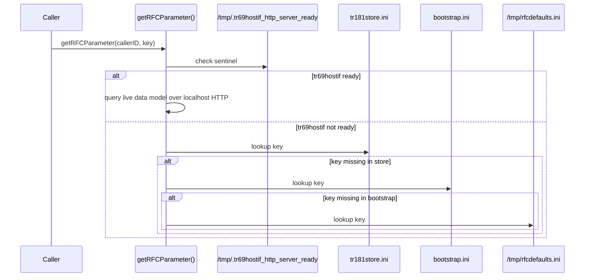
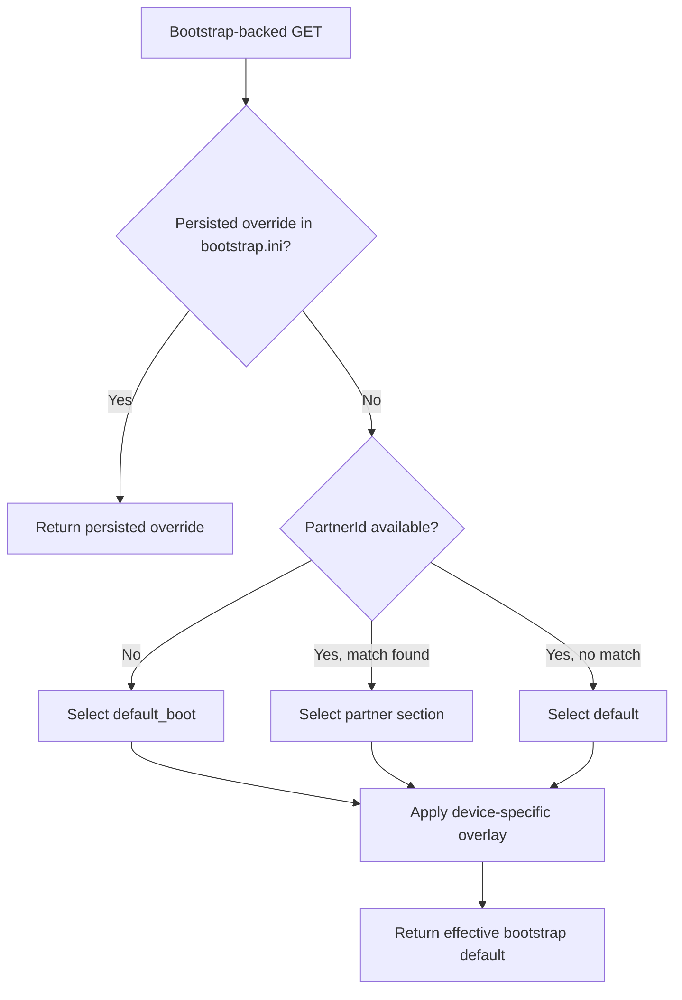

# RFC Parameter Runtime Priority

## Overview

This document explains how RFC-related parameter values are resolved at runtime across the RFC repository and the live `tr69hostif` stack.

The goal is to make the effective priority clear when the same parameter may exist in multiple runtime or default-value sources, including:

- live XConf-applied data-model values
- persisted RFC/TR181 override files
- bootstrap persistence
- partner default JSON data, including `default_boot`
- XML default values from the merged TR181 data model
- `/etc/rfcdefaults` fallback files

The key conclusion is that there is no single universal search order shared by every subsystem. The effective priority depends on which runtime path serves the request.

---

## Why This Exists

RFC-related values can be observed through more than one layer:

- `librfcapi` and `libtr181api`
- pre-hostif file-backed fallback logic
- live `tr69hostif` GET handling
- `XBSStore` bootstrap-backed parameter resolution

Without separating those paths, it is easy to confuse:

- persisted runtime overrides with firmware defaults
- bootstrap defaults with `/etc/rfcdefaults`
- XML data-model defaults with RFC defaults

This document treats `/etc/rfcdefaults` as one runtime source among several, not as the sole subject.

---

## Runtime Sources

The runtime priority discussion in this codebase can involve all of the following sources:

| Source | Backing store | Typical owner |
|------|---------------|---------------|
| Live XConf-applied data-model value | live `tr69hostif` GET path | `tr69hostif` runtime |
| Persisted TR181 RFC override | `/opt/secure/RFC/tr181store.ini` | RFC/XConf apply path |
| Persisted bootstrap value | `/opt/secure/RFC/bootstrap.ini` | `XBSStore` |
| Device-specific bootstrap overlay | `/etc/partners_defaults_device.json` | `tr69hostif` firmware defaults |
| Partner bootstrap defaults | `/etc/partners_defaults.json` partner section | `tr69hostif` firmware defaults |
| Generic steady-state bootstrap defaults | `/etc/partners_defaults.json` `default` | `tr69hostif` firmware defaults |
| Early-boot bootstrap defaults | `/etc/partners_defaults.json` `default_boot` | `tr69hostif` firmware defaults |
| XML default value | merged TR181 data model | waldb / `tr69hostif` validation path |
| RFC fallback defaults | `/etc/rfcdefaults/*.ini` and `/tmp/rfcdefaults.ini` | RFC repo fallback path |

---

## Path 1: RFC Library Runtime Priority

This is the path used by:

- `librfcapi::getRFCParameter()`
- `libtr181api::getParam()`

For TR181-style RFC keys such as `Device.DeviceInfo.X_RDKCENTRAL-COM_RFC.*`, the effective priority is:

1. Live data-model value from `tr69hostif`, when `/tmp/.tr69hostif_http_server_ready` exists
2. Persisted XConf-applied value in `/opt/secure/RFC/tr181store.ini`
3. Persisted bootstrap value in `/opt/secure/RFC/bootstrap.ini`
4. RFC fallback default from `/tmp/rfcdefaults.ini`, generated from `/etc/rfcdefaults/*.ini`

For legacy `RFC_xxxx` keys without a dot, lookup remains file-based and uses `/opt/secure/RFC/rfcVariable.ini` directly.

### Notes

- `partner_defaults`, `default`, `default_boot`, and XML default values are not read directly by `rfcapi`
- those layers influence this path only indirectly if they have already been materialized into live `tr69hostif` state or into `bootstrap.ini`

### Sequence



---

## Path 2: Bootstrap Runtime Priority

This is the path used for bootstrap-backed parameters resolved by `tr69hostif` through `XBSStore`.

Priority inside the bootstrap subsystem is:

1. Persisted RFC or WebPA override already stored in `bootstrap.ini`
2. Device-specific overlay from `partners_defaults_device.json`, if present
3. Selected section from `partners_defaults.json`

Selection inside `partners_defaults.json` is:

1. matching partner section when PartnerId is known and present
2. `default` when PartnerId is known but no partner section exists
3. `default_boot` when PartnerId is not yet available

### Important distinction

`default_boot` is not just another default bucket. It is an early-boot temporary profile used only until PartnerId becomes available.

`default` is the generic steady-state fallback after PartnerId resolution.

### Bootstrap workflow



---

## Path 3: Live `tr69hostif` GET Fallback Priority

For live HTTP, WebPA, or RBUS GET operations handled by `tr69hostif`, another fallback path exists after data-model validation.

Effective priority is:

1. Actual value returned by `hostIf_GetMsgHandler()`
2. XML `defaultValue` from the merged TR181 data model, if live GET fails and a default exists

That XML default comes from the `<default value="...">` element parsed into `dmParam.defaultValue`.

### Notes

- XML default value is separate from `/etc/rfcdefaults`
- `/etc/rfcdefaults` is not the fallback used by this live hostif GET path
- this path applies after the parameter is validated against the merged data model

---

## `/etc/rfcdefaults` As A Runtime Source

`/etc/rfcdefaults` is still important, but it is only one layer in the broader runtime-priority model.

### What it does

- `librfcapi` merges all `*.ini` files under `/etc/rfcdefaults/` into `/tmp/rfcdefaults.ini`
- `libtr181api::getDefaultValue()` reads `/etc/rfcdefaults/<callerID>.ini` directly
- `libtr181api::getLocalParam()` falls back from `tr181localstore.ini` to `/etc/rfcdefaults/<callerID>.ini`

### When it wins

For RFC-library TR181 reads, `/etc/rfcdefaults` wins only after:

1. no live `tr69hostif` value was available
2. no `tr181store.ini` value was found
3. no `bootstrap.ini` value was found

So `/etc/rfcdefaults` is a fallback for absence, not a runtime override layer.

### Merge behavior

`/tmp/rfcdefaults.ini` is created lazily by `init_rfcdefaults()`.

Important implementation details:

- creation happens when fallback reaches `RFCDEFAULTS_FILE` and the merged file is absent
- all `.ini` files are concatenated in directory iteration order
- lookup stops at the first matching `key=value` line in the merged file

If duplicate keys exist across files, effective precedence is determined by merge order, which is not explicitly sorted by the code.

---

## Combined Conceptual Priority

If you want one combined conceptual ordering across all runtime sources, the safest summary is:

1. Live value from the active hostif path, if one is returned
2. Persisted runtime override, if the relevant store already holds one
3. Persisted bootstrap value, for bootstrap-backed keys
4. Effective bootstrap firmware default from `partners_defaults_device.json` overlay plus selected `partners_defaults.json` section (`partner`, `default`, or `default_boot`)
5. XML default value from the merged TR181 data model, only on live hostif fallback paths that use `dmParam.defaultValue`
6. `/etc/rfcdefaults` merged fallback, only on RFC-library fallback paths

This is a conceptual union of multiple implementations, not a single function's exact search order.

---

## Worked Example

Consider this parameter:

```text
Device.Time.NTPServer1
```

Assume the following state:

- live `tr69hostif` GET can return `ntp.override.example`
- `/opt/secure/RFC/bootstrap.ini` contains `ntp.bootstrap.example`
- `partners_defaults_device.json` contains `ntp.device.example`
- `partners_defaults.json` partner section contains `ntp.partner.example`
- `partners_defaults.json` `default` contains `ntp.default.example`
- `partners_defaults.json` `default_boot` contains `ntp.boot.example`
- merged XML data model has default `ntp.xml.example`
- `/etc/rfcdefaults/timeclient.ini` contains `ntp.rfcdefaults.example`

### Example A: live hostif GET succeeds

Returned value:

```text
ntp.override.example
```

Why:

- the live handler succeeded, so lower fallback layers are not consulted

### Example B: bootstrap-backed lookup after persisted override was cleared

Returned value:

```text
ntp.device.example
```

Why:

- no persisted bootstrap override remains
- bootstrap resolution selects partner or default or default_boot
- device-specific overlay replaces the selected base value

### Example C: early boot before PartnerId is known

Returned value:

```text
ntp.boot.example
```

Why:

- `XBSStore` selects `default_boot`
- that early-boot firmware default becomes the active bootstrap default

### Example D: RFC-library read before hostif is ready and stores miss

Returned value:

```text
ntp.rfcdefaults.example
```

Why:

- hostif is not ready
- key is absent from `tr181store.ini`
- key is absent from `bootstrap.ini`
- final fallback is `/tmp/rfcdefaults.ini` generated from `/etc/rfcdefaults/*.ini`

### Example E: live hostif GET fails after data-model validation

Returned value:

```text
ntp.xml.example
```

Why:

- handler path failed to produce a live value
- `validateAgainstDataModel()` had already captured XML `defaultValue`
- the live request path returns the XML default, not `/etc/rfcdefaults`

---

## See Also

- [../rfcapi/docs/README.md](../rfcapi/docs/README.md)
- [../tr181api/docs/README.md](../tr181api/docs/README.md)
- https://github.com/rdkcentral/tr69hostif
