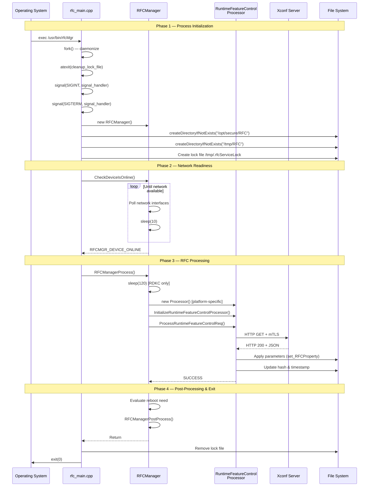
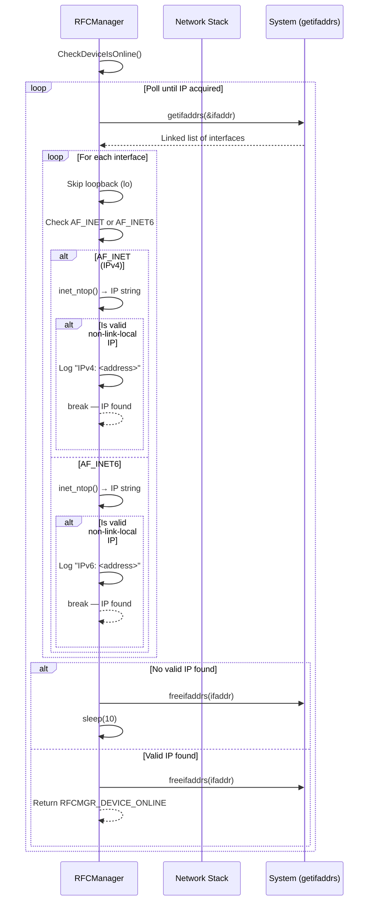
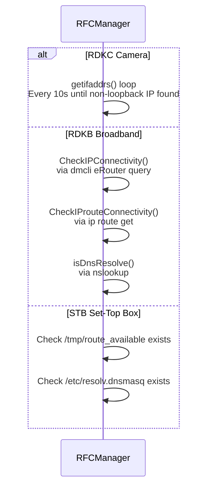
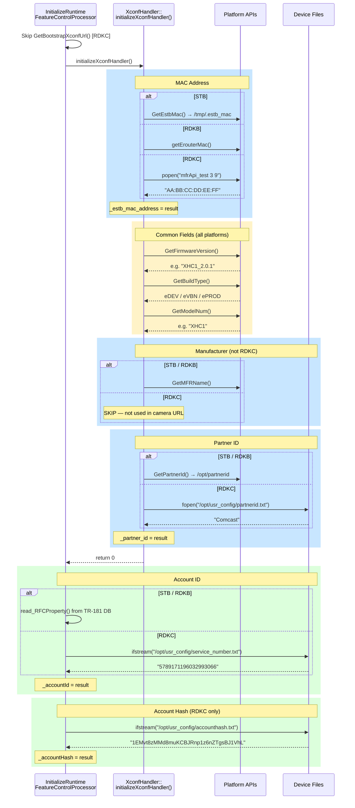
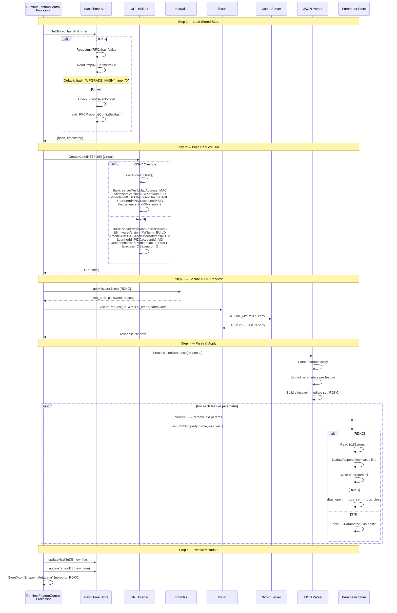
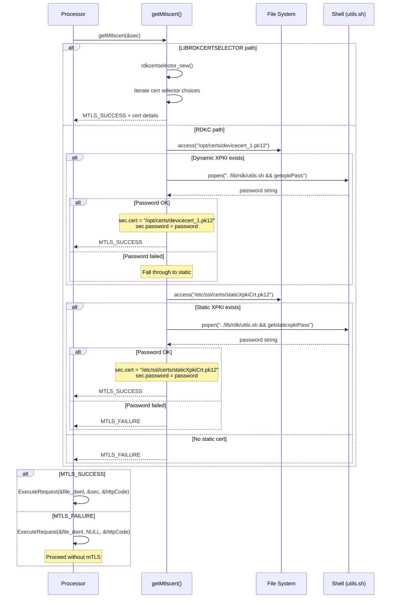
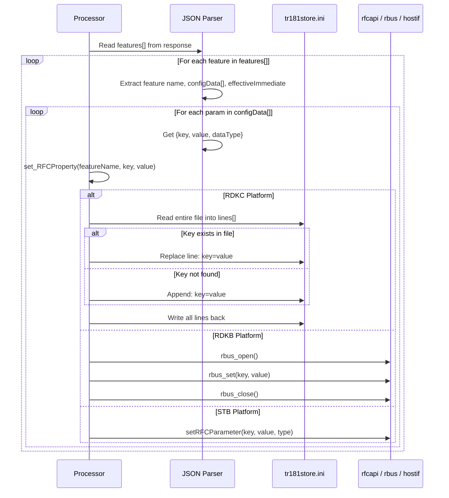
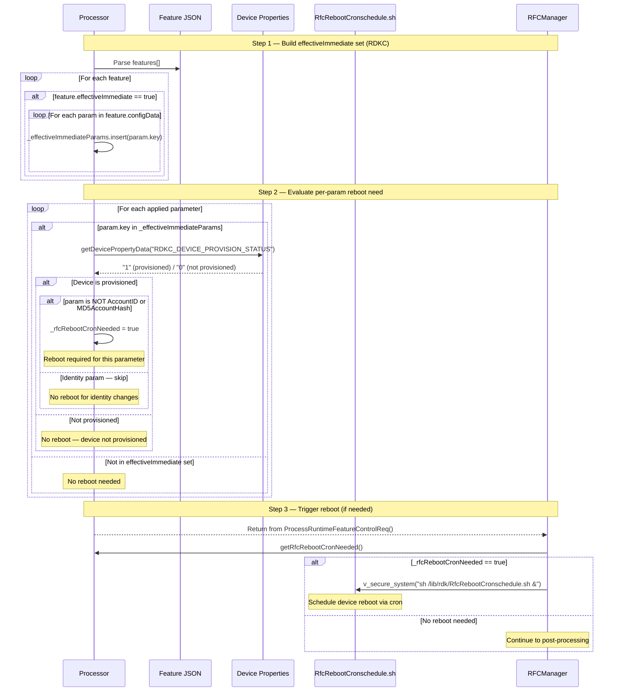
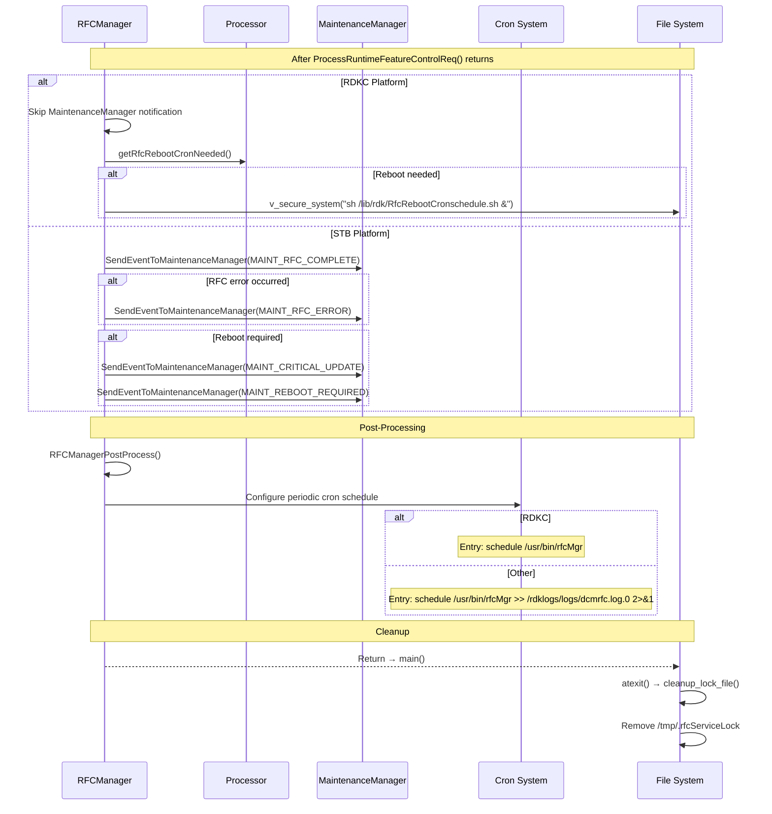

# Sequence Diagrams

> End-to-end execution flows for the RFC daemon across all operational phases.

---

## Table of Contents

- [1. Complete Startup to Shutdown](#1-complete-startup-to-shutdown)
- [2. Device Online Detection](#2-device-online-detection)
- [3. Device Identity Collection](#3-device-identity-collection)
- [4. Xconf Query & Response Processing](#4-xconf-query--response-processing)
- [5. mTLS Certificate Acquisition](#5-mtls-certificate-acquisition)
- [6. Parameter Application](#6-parameter-application)
- [7. Reboot Evaluation & Scheduling](#7-reboot-evaluation--scheduling)
- [8. Post-Processing & Cleanup](#8-post-processing--cleanup)

---

## 1. Complete Startup to Shutdown

The full lifecycle of a single `rfcMgr` invocation from process start to exit.

---

## 2. Device Online Detection

### RDKC Camera Path

### Platform Comparison

---

## 3. Device Identity Collection

---

## 4. Xconf Query & Response Processing

---

## 5. mTLS Certificate Acquisition

---

## 6. Parameter Application

---

## 7. Reboot Evaluation & Scheduling

---

## 8. Post-Processing & Cleanup

