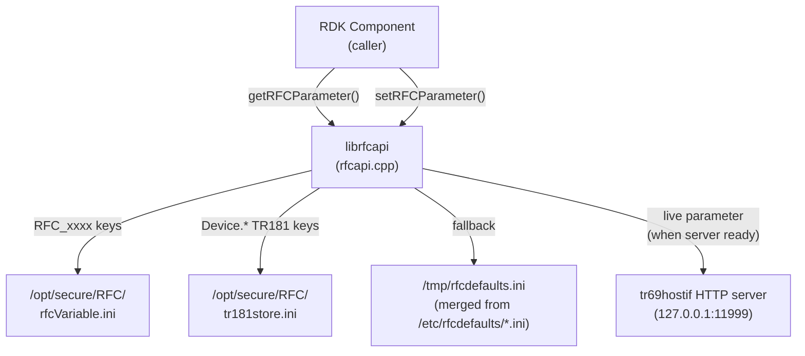
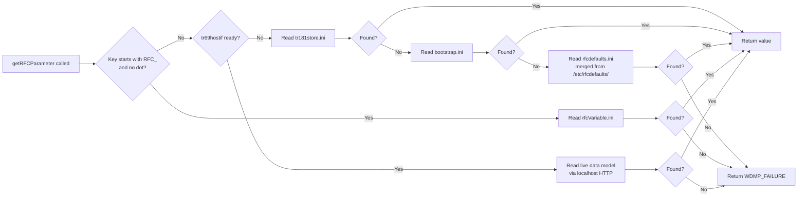
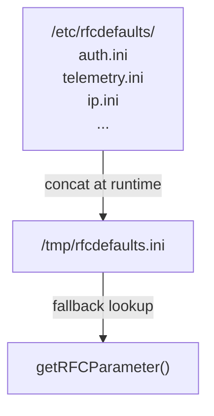

# rfcapi — RFC Parameter Get/Set API

## Overview

`librfcapi` is a C/C++ library that provides the canonical interface for reading and writing RFC (Remote Feature Control) parameters on RDK devices. When the TR-181 data model service (`tr69hostif`) is ready, reads are served from the live data model. Before that service is ready, the library falls back to layered file-backed state: XConf-applied overrides first, bootstrap values where applicable, and component defaults last. All other RDK components use this library instead of accessing the INI files directly.

---

## Architecture



### Lookup Priority

For TR181-style RFC keys (`Device.*`), the effective priority is:

1. Live TR181 data model via `tr69hostif` when `/tmp/.tr69hostif_http_server_ready` exists
2. `/opt/secure/RFC/tr181store.ini` when the host interface is not ready
3. `/opt/secure/RFC/bootstrap.ini` when the host interface is not ready and the key is not present in `tr181store.ini`
4. `/tmp/rfcdefaults.ini` as the final fallback

For legacy `RFC_xxxx` keys without a dot, the lookup remains file-based and reads `/opt/secure/RFC/rfcVariable.ini` directly.



---

## Key Components

### `RFC_ParamData_t`

Holds a single RFC parameter name–value pair.

```c
typedef struct _RFC_Param_t {
    char name[MAX_PARAM_LEN];   /* Parameter name  (max 2048 chars) */
    char value[MAX_PARAM_LEN];  /* Parameter value (max 2048 chars) */
    DATA_TYPE type;             /* Value type enum */
} RFC_ParamData_t;

#define MAX_PARAM_LEN  (2 * 1024)
```

### `DATA_TYPE`

```c
typedef enum {
    SUCCESS  = 0,   /* Used as return value AND type for RDKB */
    FAILURE  = 1,
    NONE     = 2,   /* Type unknown / not set */
    EMPTY    = 3    /* Key found but value is empty */
} DATA_TYPE;
```

---

## API Reference

### `getRFCParameter()`

Reads a single RFC parameter value from the live TR181 data model when available, otherwise from the local fallback stores.

**Signature (non-RDKB):**
```c
WDMP_STATUS getRFCParameter(const char *pcCallerID,
                             const char *pcParameterName,
                             RFC_ParamData_t *pstParamData);
```

**Signature (RDKB):**
```c
int getRFCParameter(const char *pcParameterName,
                    RFC_ParamData_t *pstParamData);
```

**Parameters:**
- `pcCallerID` — Component name used for logging (non-RDKB only; may be `NULL`)
- `pcParameterName` — Full TR181 path or `RFC_xxxx` key; must not end with `.`
- `pstParamData` — Output buffer; must be non-NULL; caller allocates

**Returns (non-RDKB):**

| Value | Meaning |
|-------|---------|
| `WDMP_SUCCESS` | Value found and copied to `pstParamData` |
| `WDMP_ERR_DEFAULT_VALUE` | Value returned from defaults file |
| `WDMP_FAILURE` | Key not found in any store |

**Returns (RDKB):** `SUCCESS` (0) or `FAILURE` (-1)

**Thread Safety:** Read-only file access. Safe to call from multiple threads concurrently.

**Example:**
```c
#include "rfcapi.h"
#include <stdio.h>

void check_account_id(void) {
    RFC_ParamData_t param;
    WDMP_STATUS ret;

    ret = getRFCParameter("mycomponent",
        "Device.DeviceInfo.X_RDKCENTRAL-COM_RFC.Feature.AccountInfo.AccountID",
        &param);

    if (ret == WDMP_SUCCESS) {
        printf("AccountID = %s\n", param.value);
    } else {
        printf("Not found: %s\n", getRFCErrorString(ret));
    }
}
```

---

### `setRFCParameter()`

Writes an RFC parameter value to the tr69hostif HTTP server.

**Signature:**
```c
WDMP_STATUS setRFCParameter(const char *pcCallerID,
                             const char *pcParameterName,
                             const char *pcParameterValue,
                             DATA_TYPE eDataType);
```

**Parameters:**
- `pcCallerID` — Component name (used for logging)
- `pcParameterName` — Full TR181 path; must not be NULL or empty
- `pcParameterValue` — Value string; must not be NULL
- `eDataType` — Data type from `DATA_TYPE` enum

**Returns:**

| Value | Meaning |
|-------|---------|
| `WDMP_SUCCESS` | Parameter written successfully |
| `WDMP_FAILURE` | Write rejected or server error |

**Thread Safety:** HTTP POST to localhost; safe for concurrent callers.

**Example:**
```c
WDMP_STATUS ret = setRFCParameter(
    "mycomponent",
    "Device.DeviceInfo.X_RDKCENTRAL-COM_RFC.Feature.Telemetry.Enable",
    "true",
    WDMP_BOOLEAN);

if (ret != WDMP_SUCCESS) {
    fprintf(stderr, "Set failed: %s\n", getRFCErrorString(ret));
}
```

---

### `isRFCEnabled()`

Convenience wrapper: reads a boolean RFC feature flag and returns `true` if its value is `"true"`.

**Signature:**
```c
bool isRFCEnabled(const char *pcParameterName);
```

**Example:**
```c
if (isRFCEnabled("Device.DeviceInfo.X_RDKCENTRAL-COM_RFC.Feature.MTLS.mTlsXConfDownload.Enable")) {
    /* enable mTLS path */
}
```

---

### `getRFCErrorString()`

Converts a `WDMP_STATUS` code to a human-readable string.

**Signature:**
```c
const char *getRFCErrorString(WDMP_STATUS code);
```

---

### `isFileInDirectory()`

Checks whether a file exists within a specified directory.

**Signature:**
```c
bool isFileInDirectory(const char *filename, const char *directory);
```

---

## File Store Details

| File | Key pattern | Written by |
|------|-------------|------------|
| `/opt/secure/RFC/rfcVariable.ini` | `RFC_xxxx` (no dot) | rfcMgr XConf apply |
| `/opt/secure/RFC/tr181store.ini` | `Device.*` TR181 paths | rfcMgr XConf apply |
| `/tmp/rfcdefaults.ini` | Any | Generated at runtime from `/etc/rfcdefaults/*.ini` |
| `/opt/secure/RFC/bootstrap.ini` | Bootstrap TR181 keys | Platform provisioning |

---

## Default Value Resolution

`getRFCParameter` merges all `.ini` files under `/etc/rfcdefaults/` into `/tmp/rfcdefaults.ini` on first access if the merged file does not exist. Component default files must be named `<componentname>.ini` and placed in `/etc/rfcdefaults/`.

`/etc/rfcdefaults/*.ini` only affects the result when a requested key was not resolved from a higher-priority source. In practice that means:

1. If `tr69hostif` is up, the live data model wins and defaults are not consulted.
2. If `tr69hostif` is not up, `tr181store.ini` wins over defaults.
3. `bootstrap.ini` also wins over defaults during the pre-hostif phase.
4. Defaults are used only as the final fallback for missing keys.



---

## Platform Variants

### RDK-V / RDK-C
- Uses `WDMP_STATUS` return type via `wdmp-c` library
- Full set: `getRFCParameter`, `setRFCParameter`, `isRFCEnabled`, `isFileInDirectory`
- `setRFCParameter` sends HTTP POST to `http://127.0.0.1:11999`

### RDK-B (`RDKB_SUPPORT`)
- Simplified `int` return type
- `setRFCParameter` not exposed from this library (rfcMgr applies directly)
- `MAX_PARAM_LEN` applies identically

---

## Testing

```bash
# Build gtest binary
./configure --enable-gtestapp=yes
make

# Run rfcapi unit tests
./rfcMgr/gtest/rfcapi_gtest

# With memory checking
valgrind --leak-check=full ./rfcMgr/gtest/rfcapi_gtest
```

Mocks for `curl`, `rdk_debug`, and file I/O are in `rfcMgr/gtest/mocks/`.

---

## See Also

- [tr181api Reference](../tr181api/docs/README.md) — Higher-level typed TR181 API
- [RFC Module Overview](../../README.md)
- [RFC API Header](../rfcapi.h)
