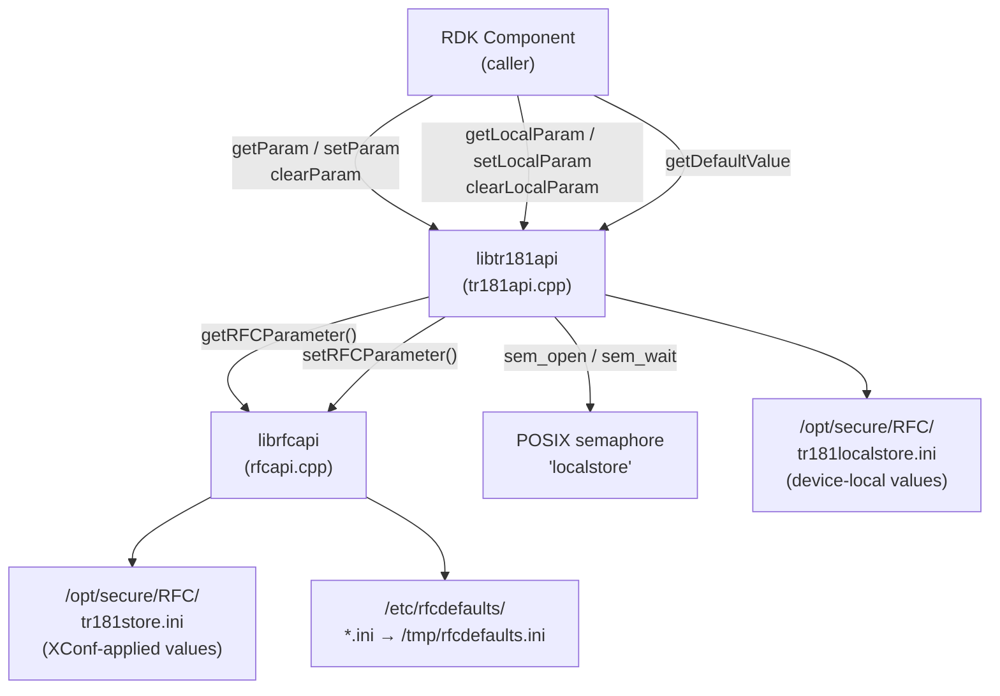
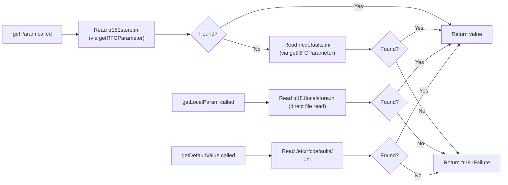
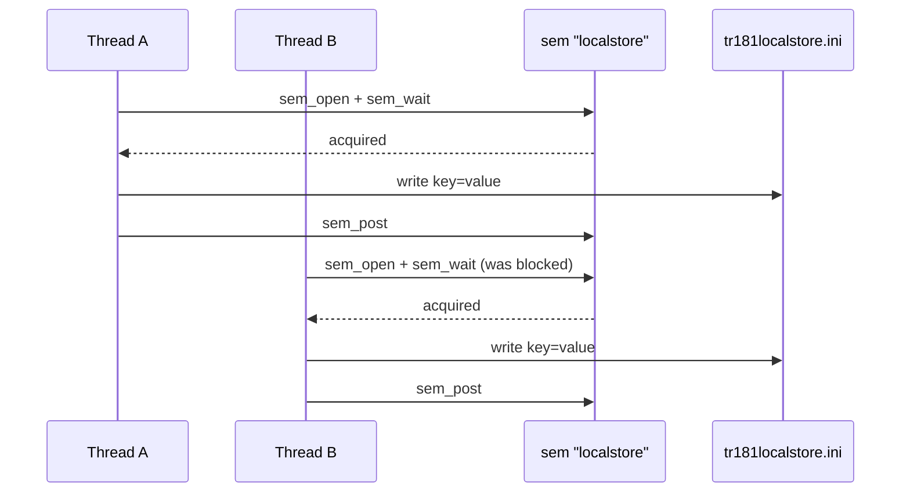

# tr181api — TR181 Parameter Store API

## Overview

`libtr181api` is a thin, typed C wrapper over `librfcapi` that exposes TR181 data-model parameters through a strongly-typed interface. It adds support for a **local store** (parameters set by device-side components, not by XConf), typed retrieval via `TR181_PARAM_TYPE`, default value lookup, and a POSIX named semaphore for write serialization.

Components that need to read/write TR181 parameters (including non-RFC ones stored locally) should use this API instead of calling `librfcapi` directly.

---

## Architecture



### Store Hierarchy



---

## Key Components

### `TR181_ParamData_t`

Holds a retrieved TR181 parameter value and its type.

```c
typedef struct _TR181_Param_t {
    char           value[MAX_PARAM_LEN];  /* Parameter value (max 2048 chars) */
    TR181_PARAM_TYPE type;                /* WDMP-derived type enum */
} TR181_ParamData_t;

#define MAX_PARAM_LEN  (2 * 1024)
```

### `TR181_PARAM_TYPE`

Maps one-to-one with `WDMP_DATA_TYPE`:

```c
typedef enum {
    TR181_STRING   = 0,
    TR181_INT      = 1,
    TR181_UINT     = 2,
    TR181_BOOLEAN  = 3,
    TR181_DATETIME = 4,
    TR181_BASE64   = 5,
    TR181_LONG     = 6,
    TR181_ULONG    = 7,
    TR181_FLOAT    = 8,
    TR181_DOUBLE   = 9,
    TR181_BYTE     = 10,
    TR181_NONE     = 11,
    TR181_BLOB     = 12
} TR181_PARAM_TYPE;
```

### `tr181ErrorCode_t`

```c
typedef enum {
    tr181Success              = 0,
    tr181Failure              = 1,
    tr181Timeout              = 2,
    tr181InvalidParameterName = 3,
    tr181InvalidParameterValue= 4,
    tr181InvalidType          = 5,
    tr181NotWritable          = 6,
    tr181ValueIsEmpty         = 7,
    tr181ValueIsNull          = 8,
    tr181InternalError        = 9,
    tr181DefaultValue         = 10
} tr181ErrorCode_t;
```

---

## API Reference

### `getParam()`

Reads a TR181 parameter from the XConf-applied store (with defaults fallback).

**Signature:**
```c
tr181ErrorCode_t getParam(char *pcCallerID,
                           const char *pcParameterName,
                           TR181_ParamData_t *pstParamData);
```

**Parameters:**
- `pcCallerID` — Caller component name (used for logging; must not be NULL)
- `pcParameterName` — Full TR181 path (e.g. `Device.DeviceInfo.X_RDKCENTRAL-COM_RFC.Feature.AccountInfo.AccountID`)
- `pstParamData` — Output buffer; caller allocates

**Returns:** `tr181Success` on success, or a `tr181ErrorCode_t` error code.

**Thread Safety:** Read-only via `getRFCParameter`; safe for concurrent calls.

**Example:**
```c
#include "tr181api.h"
#include <stdio.h>

void print_feature_flag(void) {
    TR181_ParamData_t data;
    tr181ErrorCode_t ret;

    ret = getParam("mycomponent",
        "Device.DeviceInfo.X_RDKCENTRAL-COM_RFC.Feature.Telemetry.Enable",
        &data);

    if (ret == tr181Success) {
        printf("Telemetry.Enable = %s (type %d)\n", data.value, data.type);
    } else {
        printf("Error: %s\n", getTR181ErrorString(ret));
    }
}
```

---

### `setParam()`

Writes a TR181 parameter value via `setRFCParameter` (tr69hostif).

**Signature:**
```c
tr181ErrorCode_t setParam(char *pcCallerID,
                           const char *pcParameterName,
                           const char *pcParameterValue);
```

**Parameters:**
- `pcCallerID` — Caller component name
- `pcParameterName` — Full TR181 path
- `pcParameterValue` — Value string; always sent as `WDMP_STRING`

**Returns:** `tr181Success` or mapped `tr181ErrorCode_t`.

**Thread Safety:** Delegates to `setRFCParameter` HTTP POST; safe for concurrent callers.

**Example:**
```c
tr181ErrorCode_t ret = setParam(
    "mycomponent",
    "Device.DeviceInfo.X_RDKCENTRAL-COM_RFC.Feature.Telemetry.Enable",
    "true");

if (ret != tr181Success) {
    fprintf(stderr, "setParam failed: %s\n", getTR181ErrorString(ret));
}
```

---

### `clearParam()`

Clears one or more TR181 parameters. Supports wildcard suffix to clear a whole domain.

**Signature:**
```c
tr181ErrorCode_t clearParam(char *pcCallerID,
                             const char *pcParameterName);
```

**Notes:**
- To clear an entire feature domain pass the prefix with trailing dot:
  ```c
  clearParam("sysint",
      "Device.DeviceInfo.X_RDKCENTRAL-COM_RFC.Feature.TelemetryEndpoint.");
  ```
- Internally routes through `setRFCParameter` with the special key `Device.DeviceInfo.X_RDKCENTRAL-COM_RFC.ClearParam`.

---

### `getLocalParam()`

Reads a parameter exclusively from the device-local store (`tr181localstore.ini`). XConf-applied values are **not** consulted.

**Signature:**
```c
tr181ErrorCode_t getLocalParam(char *pcCallerID,
                                const char *pcParameterName,
                                TR181_ParamData_t *pstParamData);
```

**Use case:** Components that manage their own persistent state independently of XConf policy.

---

### `setLocalParam()`

Writes a parameter directly to `tr181localstore.ini`, protected by the `localstore` POSIX semaphore.

**Signature:**
```c
tr181ErrorCode_t setLocalParam(char *pcCallerID,
                                const char *pcParameterName,
                                const char *pcParameterValue);
```

**Thread Safety:** Write-serialized via `sem_open("localstore", ...)`. Safe for concurrent callers.

**Example:**
```c
tr181ErrorCode_t ret = setLocalParam(
    "authservice",
    "Device.DeviceInfo.X_RDKCENTRAL-COM_RFC.Feature.AuthCode",
    "abc123");
```

---

### `clearLocalParam()`

Removes a parameter (or domain) from `tr181localstore.ini`.

**Signature:**
```c
tr181ErrorCode_t clearLocalParam(char *pcCallerID,
                                  const char *pcParameterName);
```

---

### `getDefaultValue()`

Reads a parameter default from the caller's own defaults INI file (`/etc/rfcdefaults/<callerID>.ini`). Does not fall back to the merged file.

**Signature:**
```c
tr181ErrorCode_t getDefaultValue(char *pcCallerID,
                                  const char *pcParameterName,
                                  TR181_ParamData_t *pstParamData);
```

**Example:**
```c
TR181_ParamData_t data;
// Reads from /etc/rfcdefaults/authservice.ini
getDefaultValue("authservice",
    "Device.DeviceInfo.X_RDKCENTRAL-COM_RFC.Feature.AuthCode",
    &data);
```

---

### `getTR181ErrorString()`

Returns a human-readable string for a `tr181ErrorCode_t`.

**Signature:**
```c
const char *getTR181ErrorString(tr181ErrorCode_t code);
```

---

## Write Serialization (Local Store)

`setLocalParam` and `clearLocalParam` acquire a POSIX named semaphore before modifying `tr181localstore.ini`:



The semaphore name is `"localstore"` (`/sem.localstore` on Linux). It is opened with `O_CREAT` and initial count 1 each call, so no persistent initialization is required.

---

## Error Code Mapping

`libtr181api` maps `WDMP_STATUS` codes from `librfcapi` to `tr181ErrorCode_t`:

| `WDMP_STATUS` | `tr181ErrorCode_t` |
|--------------|-------------------|
| `WDMP_SUCCESS` | `tr181Success` |
| `WDMP_FAILURE` | `tr181Failure` |
| `WDMP_ERR_TIMEOUT` | `tr181Timeout` |
| `WDMP_ERR_INVALID_PARAMETER_NAME` | `tr181InvalidParameterName` |
| `WDMP_ERR_INVALID_PARAMETER_VALUE` | `tr181InvalidParameterValue` |
| `WDMP_ERR_INVALID_PARAMETER_TYPE` | `tr181InvalidType` |
| `WDMP_ERR_NOT_WRITABLE` | `tr181NotWritable` |
| `WDMP_ERR_VALUE_IS_EMPTY` | `tr181ValueIsEmpty` |
| `WDMP_ERR_VALUE_IS_NULL` | `tr181ValueIsNull` |
| `WDMP_ERR_DEFAULT_VALUE` | `tr181DefaultValue` |
| `WDMP_ERR_INTERNAL_ERROR` | `tr181InternalError` |

---

## File Paths

| Path | API | Description |
|------|-----|-------------|
| `/opt/secure/RFC/tr181store.ini` | `getParam` | XConf-applied TR181 parameters |
| `/opt/secure/RFC/tr181localstore.ini` | `getLocalParam` / `setLocalParam` | Device-local TR181 parameters |
| `/tmp/rfcdefaults.ini` | `getParam` (fallback) | Merged component defaults |
| `/etc/rfcdefaults/<callerID>.ini` | `getDefaultValue` | Per-component default values |

> **Secure path variant:** Build with `-DUSE_NONSECURE_TR181_LOCALSTORE` to redirect local store to `/opt/persistent/tr181localstore.ini`.

---

## Testing

```bash
# Build gtest binary
./configure --enable-gtestapp=yes
make

# Run tr181api unit tests
./rfcMgr/gtest/tr181api_gtest

# With memory checking
valgrind --leak-check=full ./rfcMgr/gtest/tr181api_gtest
```

L2 coverage for `setParam`/`getParam` flows:
```bash
sh run_l2.sh   # runs test_rfc_setget_param.py and test_rfc_tr181_setget_local_param.py
```

---

## See Also

- [rfcapi Reference](../../rfcapi/docs/README.md) — Lower-level RFC get/set API
- [RFC Module Overview](../../README.md)
- [TR181 API Header](../tr181api.h)
